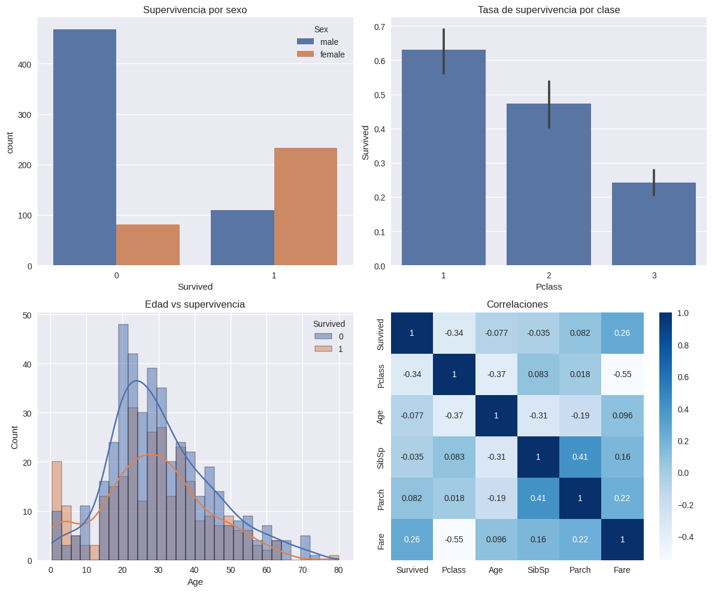

# TA1 - Análisis Exploratorio del Dataset Titanic

## Resumen de la Tarea

LA **TA1** consistió en realizar un análisis exploratorio de datos (EDA) del dataset del Titanic, disponible en Kaggle. El objetivo principal fue entender los factores que influyeron en la supervivencia de los pasajeros durante el hundimiento del Titanic en 1912.

### Metodología

1. **Descarga y carga de datos**: Se utilizó la API de Kaggle para descargar el dataset directamente en Google Colab
2. **Exploración inicial**: Análisis de la estructura, tipos de datos y estadísticas descriptivas
3. **Análisis de valores faltantes**: Identificación de columnas con datos missing
4. **Visualización**: Creación de gráficos para entender las relaciones entre variables
5. **Análisis de correlaciones**: Estudio de las correlaciones entre variables numéricas

### Dataset

- **Tamaño**: 891 registros de entrenamiento
- **Variables**: 12 columnas incluyendo la variable objetivo `Survived`
- **Tipos de datos**: Variables numéricas  y categóricas.

## Visualizaciones Principales

El análisis incluyó cuatro visualizaciones clave organizadas en una matriz 2x2:



```python
fig, axes = plt.subplots(2, 2, figsize=(12, 10))

# 1. Supervivencia por sexo
sns.countplot(data=train, x='Survived', hue='Sex', ax=axes[0,0])

# 2. Tasa de supervivencia por clase
sns.barplot(data=train, x='Pclass', y='Survived', estimator=np.mean, ax=axes[0,1])

# 3. Distribución de edad por supervivencia
sns.histplot(data=train, x='Age', hue='Survived', kde=True, bins=30, ax=axes[1,0])

# 4. Mapa de correlaciones
numeric_cols = ['Survived', 'Pclass', 'Age', 'SibSp', 'Parch', 'Fare']
sns.heatbox(train[numeric_cols].corr(), annot=True, cmap='Blues', ax=axes[1,1])
```

Los gráficos muestran claramente los patrones identificados en el análisis:

## Análisis de Resultados

### ¿Qué variables parecen más relacionadas con Survived?

Basándose en el análisis realizado, las variables más relacionadas con la supervivencia son:

1. **Sex (Sexo)**: La variable más influyente. Las mujeres tuvieron una tasa de supervivencia significativamente mayor que los hombres, reflejando la política de "mujeres y niños primero".

2. **Pclass (Clase de pasajero)**: Fuerte correlación negativa con supervivencia. Los pasajeros de primera clase tuvieron mayor probabilidad de sobrevivir que los de segunda y tercera clase.

3. **Fare (Tarifa)**: Correlación positiva con supervivencia. Tarifas más altas (asociadas con mejores ubicaciones y servicios) se relacionaron con mayor supervivencia.

4. **Age (Edad)**: Los niños y adultos jóvenes tuvieron mejores tasas de supervivencia, aunque la relación es menos clara que las variables anteriores.

### ¿Dónde hay más valores faltantes? ¿Cómo los imputarías?

Los valores faltantes se distribuyen así:

1. **Cabin (Cabina)**: 687 valores faltantes (~77% de los datos)
   - **Estrategia de imputación**: Se podría eliminar esta variable debido al alto porcentaje de datos faltantes.

2. **Age (Edad)**: 177 valores faltantes (~20% de los datos)
   - **Estrategia de imputación**: 
     - Imputación por mediana/media según la clase y sexo
     - Usar regresión lineal basada en variables como `Pclass`, `Sex`, `SibSp`, `Parch`

3. **Embarked (Puerto de embarque)**: 2 valores faltantes (~0.2% de los datos)
   - **Estrategia de imputación**: Imputar con la moda (puerto más común).

### ¿Qué hipótesis probarías a continuación?

1. **Hipótesis de ubicación en el barco**: 
   - Los pasajeros ubicados en cubiertas superiores (extraído de `Cabin`) tuvieron mayor supervivencia

2. **Hipótesis familiar**:
   - Las familias pequeñas (2-4 miembros) tuvieron mejor supervivencia que individuos solos o familias muy grandes


## Conclusiones

El análisis exploratorio reveló que la supervivencia en el Titanic estuvo fuertemente influenciada por factores socioeconómicos y demográficos. Las variables más predictivas fueron el sexo, la clase del pasajero y la tarifa pagada. 
