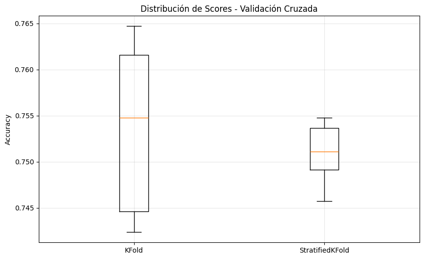

# TA4 - Validación y Selección de Modelos

## Resumen de la Tarea

Esta tarea consistió en implementar técnicas avanzadas de validación cruzada y selección de modelos para evaluar la estabilidad y rendimiento de diferentes algoritmos de machine learning. El objetivo principal fue comprender la importancia de la validación rigurosa, comparar métodos de validación cruzada, y seleccionar el mejor modelo basándose en criterios de rendimiento y estabilidad.

### Metodología

1. **Dataset utilizado**: Student Dropout and Academic Success (UCI ML Repository)
   - 4,424 estudiantes con 36 características
   - Problema multiclase: Dropout (32.1%), Enrolled (17.9%), Graduate (49.9%)

2. **Técnicas de validación cruzada**:
   - **KFold**: División simple en 5 partes
   - **StratifiedKFold**: Mantiene proporción de clases en cada fold

3. **Comparación de modelos**:
   - Logistic Regression con StandardScaler
   - Ridge Classifier con regularización L2
   - Random Forest (ensemble method)

4. **Métricas de evaluación**:
   - F1-score weighted para manejar clases desbalanceadas
   - Análisis de estabilidad mediante desviación estándar
   - Visualización comparativa de distribuciones

### Dataset: Student Dropout and Academic Success

- **Estudiantes**: 4,424 registros
- **Características**: 36 variables (edad al inscribirse, calificaciones previas, estado civil, etc.)
- **Clases**: Dropout (0), Enrolled (1), Graduate (2)
- **Distribución**: Desbalanceada con predominio de graduados (49.9%)

## Resultados de Validación Cruzada

### Comparación KFold vs StratifiedKFold

**KFold (5 splits):**

- Scores individuales: [0.742, 0.745, 0.755, 0.762, 0.765]
- **Resultado**: 75.36% ± 0.89%

**StratifiedKFold (5 splits):**

- Scores individuales: [0.755, 0.746, 0.754, 0.749, 0.751]
- **Resultado**: 75.09% ± 0.32%

**Conclusión**: StratifiedKFold es **MÁS ESTABLE** (menor variabilidad: 0.32% vs 0.89%)

### Competencia de Modelos

**Resultados con 5-Fold Cross-Validation (F1-weighted):**

1. **🏆 Random Forest**: 74.94% ± 0.41% (GANADOR)
2. **Logistic Regression**: 74.42% ± 0.71%
3. **Ridge Classifier**: 70.96% ± 0.47%

**Análisis de estabilidad**: Todos los modelos son **MUY ESTABLES** (std < 0.02)

Los gráficos muestran la distribución de scores y la comparación visual entre los diferentes métodos de validación cruzada y modelos evaluados.

## Parte 1: Definiciones de Cross-Validation

**Cross-Validation**: Técnica que divide los datos en **múltiples** partes para entrenar y evaluar múltiples veces.

**Accuracy promedio**: La **estimación** de rendimiento esperado en datos nuevos.

**Desviación estándar**: Indica qué tan **estable** es el modelo entre diferentes divisiones de datos.

**StratifiedKFold**: Mantiene la **proporción** de clases en cada fold, especialmente importante en datasets desbalanceados.

### Interpretación

- **Cross-validation 5-fold**: Dividimos en 5 partes, entrenamos 5 veces diferentes
- **75.09% ± 0.32%**: Rendimiento esperado con alta confianza
- **Baja desviación (0.32%)**: Modelo muy consistente entre diferentes divisiones

## Parte 2: ¿Cuándo usar cada método?

GridSearchCV cuando se tiene pocos hiperparámetros y suficiente tiempo de cómputo.

RandomizedSearchCV cuando tienes muchos hiperparámetros o tiempo** limitado.

Pipeline + SearchCV siempre previene data leakage automáticamente.

cross_val_score en el resultado final valida que la optimización no causó** overfitting.

### Aplicación práctica

- **GridSearchCV**: Ideal para optimizar 2-3 hiperparámetros con búsqueda exhaustiva
- **RandomizedSearchCV**: Mejor para Random Forest con muchos parámetros (n_estimators, max_depth, etc.)
- **Pipeline**: En el TA4 previno que StandardScaler viera datos de test durante CV
- **cross_val_score**: Confirmó que Random Forest no se sobreajustó durante la selección

## Parte 3: ¿Por qué es importante la explicabilidad?

La explicabilidad es crucial porque los educadores necesitan entender por qué el modelo predice abandono para generar confianza, conocer las características importantes permite crear estrategias de intervención específicas, ayuda a detectar sesgos en el modelo, muchos contextos requieren modelos interpretables por ley, y entender el modelo facilita la mejora continua de futuras versiones.

## Parte 4: Preguntas de Reflexión

### ¿Qué es data leakage y por qué es peligroso?

Data leakage ocurre cuando información que no debería estar disponible durante el entrenamiento "se filtra" al modelo, creando una ventaja artificial que no existirá en producción.

### ¿Cuándo usar KFold vs StratifiedKFold?

KFold es apropiado para problemas de regresión donde no hay clases o en datasets muy grandes donde la proporción se mantiene naturalmente, mientras que StratifiedKFold debe usarse cuando hay clases desbalanceadas, clases minoritarias que podrían desaparecer en algunos folds, y como práctica defensiva siempre en clasificación. En esta tarea, StratifiedKFold fue esencial porque con solo 17.9% de estudiantes "Enrolled", KFold podría crear folds sin esta clase minoritaria.

### ¿Cómo interpretar "75.09% ± 0.32%" en cross-validation?

El valor 75.09% representa el rendimiento promedio esperado en datos nuevos, mientras que ± 0.32% es el intervalo de confianza que indica que el modelo es muy estable, con un rango entre 74.77% y 75.41% en el 68% de los casos. Esta desviación muy baja indica un modelo robusto. Por ejemplo, 75.09% ± 0.32% es mucho mejor que 75.36% ± 0.89% porque la menor variabilidad indica mayor confiabilidad.

### ¿Por qué Random Forest no necesita StandardScaler?

Random Forest está basado en árboles de decisión que toman decisiones mediante comparaciones ordinales (mayor/menor) en lugar de distancias euclidianas, por lo que no necesita StandardScaler en su Pipeline, mientras que modelos como Logistic Regression y Ridge sí lo requieren porque calculan distancias y son sensibles a la escala de las variables.

### En diagnóstico médico, ¿prefieres 98% accuracy pero inestable, o 95% accuracy pero muy estable?

Prefiero 95% accuracy pero muy estable. Un modelo que varía mucho genera desconfianza en los profesionales médicos, las decisiones consistentes son cruciales para tratamientos que afectan vidas humanas, un modelo estable es más fácil de mantener y actualizar en producción, y 3% menos de accuracy es preferible a predicciones erráticas que podrían cambiar el diagnóstico del mismo paciente en diferentes momentos.

## Conclusiones

En esta tarea demostramos que StratifiedKFold es superior para datasets desbalanceados (0.32% vs 0.89% de variabilidad), que Random Forest ganó la competencia con 74.94% ± 0.41% de F1-score, que todos los modelos fueron estables (std < 0.02) indicando validación robusta, que los Pipelines previenen data leakage automáticamente en validación cruzada, y que la estabilidad es tan importante como el rendimiento en aplicaciones reales. Los resultados confirman que una validación rigurosa es fundamental para seleccionar modelos confiables que funcionen bien en producción, especialmente en contextos sensibles como la educación donde las decisiones afectan el futuro de los estudiantes.
