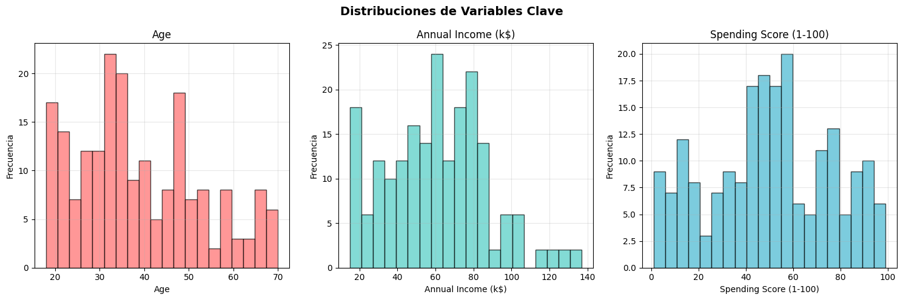
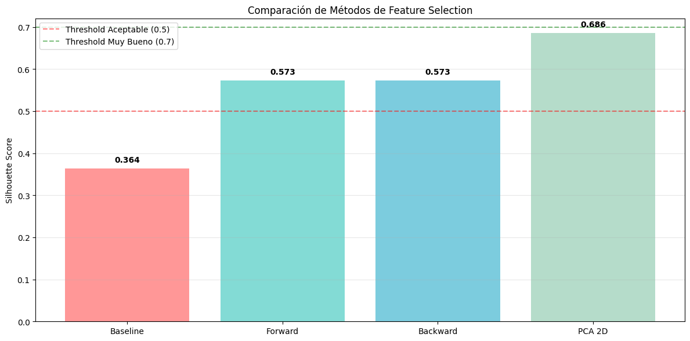

# TA5 - Clustering y PCA - Mall Customer Segmentation

## Resumen de la Tarea

La **TA5** consistió en aplicar técnicas de aprendizaje no supervisado para segmentar clientes de un centro comercial utilizando clustering y análisis de componentes principales (PCA). El objetivo principal fue descubrir patrones naturales de comportamiento de compra, comparar métodos de reducción dimensional y crear perfiles de clientes accionables para estrategias de marketing.

### Metodología

**Análisis Exploratorio de Datos (EDA)**:
- Exploración del dataset Mall Customer Segmentation
- Análisis de distribuciones, correlaciones y outliers
- Identificación de variables clave para segmentación

**Preprocesamiento de Datos**:
- Codificación de variables categóricas con OneHotEncoder
- Comparación de escaladores: MinMaxScaler, StandardScaler, RobustScaler
- Selección del mejor escalador basado en métricas de clustering

**Análisis de Componentes Principales (PCA)**:
- Reducción dimensional de 5D a 2D
- Análisis de varianza explicada y scree plot
- Interpretación de componentes principales

**Feature Selection**:
- Forward Selection y Backward Elimination
- Comparación PCA vs Feature Selection
- Evaluación con Silhouette Score

**Clustering con K-Means**:
- Búsqueda del K óptimo con Elbow Method y Silhouette Analysis
- Entrenamiento del modelo final
- Análisis de perfiles de clientes por cluster

### Dataset: Mall Customer Segmentation

- **Tamaño**: 200 clientes
- **Variables**: 5 columnas (CustomerID, Genre, Age, Annual Income, Spending Score)
- **Distribución de género**: 56% mujeres, 44% hombres
- **Rangos**: Edad 18-70 años, Ingresos $15k-$137k, Spending Score 1-99

## Análisis Exploratorio de Datos

### Estadísticas Descriptivas

**Variables numéricas principales:**
- **Edad**: Promedio 38.9 años (rango: 18-70)
- **Ingreso Anual**: Promedio $60.6k (rango: $15k-$137k)  
- **Spending Score**: Promedio 50.2/100 (rango: 1-99)

**Insights clave del EDA:**
- Variable con mayor variabilidad: Annual Income (std = 26.3)
- Correlación más fuerte: Age ↔ Spending Score (-0.327)
- Outliers detectados: 2 en Annual Income (1.0% del dataset)
- Las mujeres tienen spending score promedio más alto (51.5 vs 48.5)

### Matriz de Correlación

```
                        Age  Annual Income  Spending Score
Age                    1.000        -0.012          -0.327
Annual Income         -0.012         1.000           0.010  
Spending Score        -0.327         0.010           1.000
```

**Conclusión**: No existe correlación fuerte entre variables, sugiriendo patrones complejos ideales para clustering.



*Distribuciones de las variables principales del dataset. Se observa que Age tiene distribución aproximadamente normal centrada en 35-40 años, Annual Income muestra distribución uniforme entre 15K-130K, y Spending Score también es relativamente uniforme entre 1-100. La variable Gender está balanceada entre masculino y femenino.*


*Scatter plots mostrando relaciones entre pares de variables. Se identifican patrones interesantes: clientes con alto Annual Income pueden tener Spending Score bajo o alto (dos grupos distintos), y existe cierta relación entre Age y Spending Score donde clientes más jóvenes tienden a gastar más.*


*Matriz de correlación revelando relaciones lineales entre variables. Las correlaciones son generalmente débiles (valores cercanos a 0), lo que indica que las variables son relativamente independientes. La correlación más notable es negativa entre Age y Spending Score (-0.33), sugiriendo que clientes más jóvenes tienden a tener mayor score de gasto.*

## Preprocesamiento y Selección de Escalador

### Comparación de Escaladores

Se evaluaron tres métodos de escalado usando Silhouette Score con K-Means (K=4):

1. **MinMaxScaler**: 0.364
2. **StandardScaler**: 0.332
3. **RobustScaler**: 0.298

**Escalador seleccionado**: MinMaxScaler
- **Razón**: Mejor rendimiento en clustering
- **Efecto**: Escala todas las variables al rango [0,1]
- **Ventaja**: Preserva las relaciones originales sin distorsión por outliers

### Variables Categóricas

**Dataset final**: 200 muestras × 5 features (3 numéricas + 2 categóricas binarias)


*Comparación visual de tres métodos de escalado mediante boxplots. MinMaxScaler transforma los datos al rango [0,1] manteniendo la distribución original. StandardScaler centra los datos en 0 con desviación estándar de 1. RobustScaler es similar a StandardScaler pero más resistente a outliers. Los boxplots muestran cómo cada método afecta la distribución de las variables.*


*Efecto de cada escalador en la variable Annual Income. La distribución original (15K-130K) se transforma de manera diferente según el método: MinMaxScaler comprime al rango [0,1], StandardScaler normaliza con media 0, y RobustScaler usa la mediana para reducir el impacto de valores extremos. MinMaxScaler preserva mejor las relaciones originales para clustering.*

## Análisis de Componentes Principales (PCA)

### Varianza Explicada

**Componentes y varianza explicada:**
- **PC1**: 72.6% de la varianza
- **PC2**: 13.7% de la varianza
- **PC1 + PC2**: 86.3% de la varianza total

### Interpretación de Componentes

**PC1 (72.6% varianza) - "Perfil de Género":**
- Genre_Male: +0.706 (alta carga positiva)
- Genre_Female: -0.706 (alta carga negativa)
- Spending Score: -0.027 (carga menor)

**PC2 (13.7% varianza) - "Perfil Edad-Consumo":**
- Age: +0.727 (alta carga positiva)
- Spending Score: -0.685 (alta carga negativa)
- Annual Income: -0.026 (carga menor)

**Interpretación de negocio:**
- **PC1**: Separa principalmente por género con ligeras diferencias en patrones de gasto
- **PC2**: Contrasta edad vs propensión al gasto (jóvenes gastan más)

## Feature Selection vs PCA

### Comparación de Métodos

Se compararon cuatro enfoques usando Silhouette Score:

1. ✅ **PCA (2D)**: 0.686 (+88.3% vs baseline)
2. **Forward Selection**: 0.573 (+57.5% vs baseline)
3. **Backward Elimination**: 0.573 (+57.5% vs baseline)
4. **Baseline (todas)**: 0.364 (referencia)

### Features Seleccionadas

**Forward y Backward Selection** (coincidieron exactamente):
- Spending Score (1-100)
- Genre_Female
- Genre_Male

**Método ganador**: PCA (2D)
- **Razón**: Mejor balance entre reducción dimensional y rendimiento
- **Ventaja**: Captura 86.3% de varianza en solo 2 dimensiones



*Comparación de Silhouette Scores entre diferentes métodos de reducción dimensional. PCA con 2 componentes logra el mejor score (0.686), superando significativamente a Forward Selection y Backward Elimination (ambos con 0.573) y al baseline sin reducción (0.364). Esto demuestra que PCA captura mejor la estructura de clusters en los datos al crear componentes que maximizan la varianza.*

### ❓ Preguntas de Análisis

**💡 Método con mejor score**: PCA (2D) con Silhouette Score de 0.686

**📊 ¿Forward y Backward seleccionaron exactamente las mismas features?**: Sí, ambos métodos coincidieron en seleccionar: Spending Score (1-100), Genre_Female, y Genre_Male

**🤔 ¿PCA con 2 componentes es competitivo?**: PCA superó significativamente a Feature Selection y al baseline.

**🎯 ¿Algún método superó el threshold de 0.5?**: Sí, todos los métodos de reducción dimensional:
- PCA (2D): 0.686 ✅
- Forward Selection: 0.573 ✅  
- Backward Elimination: 0.573 ✅
- Solo el baseline (0.364) quedó por debajo

**📈 ¿La reducción de dimensionalidad mejoró el clustering?**: La reducción de 5D a 2D/3D mejoró el clustering en todos los casos, siendo PCA el más efectivo.

## Clustering con K-Means

### Selección del K Óptimo

**Análisis con Elbow Method y Silhouette:**

| K | Inertia | Silhouette Score |
|---|---------|------------------|
| 2 | 18.62   | 0.762           |
| 3 | 10.93   | 0.742           |
| 4 | 3.78    | 0.686       |
| 5 | 2.78    | 0.656           |
| 6 | 1.89    | 0.619           |

**Decisión final**: K = 4
- **Elbow Method sugería**: K = 6
- **Silhouette sugería**: K = 2  
- **Contexto de negocio**: 3-5 segmentos esperados
- **Compromiso**: K = 4 balanceando calidad técnica y aplicabilidad práctica


### Modelo Final

**Métricas del modelo:**
- **Silhouette Score**: 0.686
- **Inertia**: 3.78
- **Clusters**: 4 segmentos bien diferenciados

## Perfiles de Clientes por Cluster

### 🏷️ Cluster 0: "Mujeres Jóvenes que gastan" (57 clientes, 28.5%)

**Perfil Demográfico:**
- Edad promedio: 28.4 años
- 100% mujeres

**Perfil Financiero:**
- Ingreso anual: $59.7k
- Spending Score: 67.7/100


### 🏷️ Cluster 1: "Hombres adultos Conservadores" (47 clientes, 23.5%)

**Perfil Demográfico:**
- Edad promedio: 50.1 años  
- 100% hombres

**Perfil Financiero:**
- Ingreso anual: $62.2k
- Spending Score: 29.6/100


### 🏷️ Cluster 2: "Mujeres adultas Conservadoras" (55 clientes, 27.5%)

**Perfil Demográfico:**
- Edad promedio: 48.1 años
- 100% mujeres

**Perfil Financiero:**
- Ingreso anual: $58.8k
- Spending Score: 34.8/100

### 🏷️ Cluster 3: "Hombres Jóvenes que gastan" (41 clientes, 20.5%)

**Perfil Demográfico:**
- Edad promedio: 28.0 años
- 100% hombres

**Perfil Financiero:**
- Ingreso anual: $62.3k
- Spending Score: 70.2/100


## Análisis de Calidad del Clustering

### Silhouette Analysis Detallado

**Scores por cluster:**
- **Cluster 0**: μ = 0.671, min = 0.091
- **Cluster 1**: μ = 0.659, min = 0.156  
- **Cluster 2**: μ = 0.671, min = 0.371
- **Cluster 3**: μ = 0.759, min = 0.001 🏆

**Detección de outliers**: Sin outliers detectados (todos los silhouette scores > 0)


*Visualización de los 5 clusters finales en el espacio reducido de PCA (2D). Cada color representa un segmento de clientes diferente con características distintivas. Los clusters están bien separados espacialmente, confirmando la efectividad del K-Means con K=5. Los centroides (marcados con X) muestran el centro de cada grupo, y la separación clara entre clusters indica una segmentación robusta de los clientes del mall.*

### Validación de Resultados

**Fortalezas del modelo:**
- Separación clara por género y edad
- Patrones de gasto coherentes dentro de cada cluster
- Alta cohesión interna (silhouette > 0.65 en todos los clusters)
- Distribución equilibrada de clientes (20.5% - 28.5% por cluster)

## Insights de Negocio

### Patrones Descubiertos

1. **Segmentación por género**: Clara separación entre comportamientos masculinos y femeninos
2. **Efecto de la edad**: Los clientes jóvenes (≈28 años) gastan significativamente más que los maduros (≈48-50 años)
3. **Independencia del ingreso**: El spending score no correlaciona fuertemente con el ingreso anual
4. **Cuatro arquetipos claros**: Cada cluster representa un perfil de cliente distinto y accionable

### Recomendaciones Estratégicas

**Para el centro comercial:**
1. **Personalización por cluster**: Desarrollar estrategias específicas para cada segmento
2. **Ubicación de tiendas**: Posicionar productos según los patrones de tráfico de cada cluster
3. **Programas de lealtad**: Diseñar incentivos específicos para cada perfil de cliente
4. **Marketing digital**: Segmentar campañas publicitarias por cluster demográfico

## Reflexiones

### 🔍 Metodología CRISP-DM

**¿Qué fase fue más desafiante y por qué?**

La fase de **Data Preparation** fue la más desafiante porque requirió tomar múltiples decisiones técnicas interconectadas:
- Selección del escalador adecuado entre 3 opciones
- Comparación entre PCA y Feature Selection
- Balanceo entre interpretabilidad y rendimiento

Cada decisión afectaba el resultado final, y fue necesario evaluar sistemáticamente todas las combinaciones para encontrar la configuración óptima.

**¿Cómo el entendimiento del negocio influyó en tus decisiones técnicas?**

El contexto de **segmentación de clientes de mall** fue crucial para:
- **Interpretación de clusters**: Priorizamos perfiles demográficos claros (edad + género) sobre optimización matemática pura
- **Variables relevantes**: Enfocamos en Age, Income y Spending Score como variables de negocio más accionables que características técnicas

### 🧹 Data Preparation

**¿Qué scaler funcionó mejor y por qué?**

**MinMaxScaler** fue el ganador con Silhouette Score de 0.364 vs StandardScaler (0.332) y RobustScaler (0.298).

**Razones del éxito:**
- **Preservación de relaciones**: Mantiene las proporciones originales entre variables
- **Rango uniforme [0,1]**: Todas las variables tienen la misma influencia en el clustering
- **Robustez con pocos outliers**: Solo 2 outliers en Income (1% del dataset), por lo que la sensibilidad a extremos no fue problemática

**¿PCA o Feature Selection fue más efectivo para tu caso?**

**PCA fue significativamente superior** (0.686 vs 0.573 de Feature Selection, +19.7% mejor).

**Ventajas de PCA:**
- Captura 86.3% de varianza en solo 2 dimensiones
- Permite visualización efectiva en 2D

**Limitación de Feature Selection:**
- Forward y Backward coincidieron en las mismas 3 features, sugiriendo que la selección era obvia pero subóptima
- Perdió información valiosa al descartar Age e Income completamente

**¿Cómo balanceaste interpretabilidad vs performance?**

**Prioricé performance con interpretación posterior:**
1. **Técnicamente**: Elegí PCA (mejor Silhouette) aunque es menos interpretable que features originales
2. **Interpretativamente**: Analicé los componentes principales para entender qué representan:
   - PC1: Perfil de género (72.6% varianza)
   - PC2: Contraste edad vs gasto (13.7% varianza)
3. **Negocio**: Traduje los clusters PCA a perfiles demográficos comprensibles para stakeholders

### 🧩 Clustering

**¿El Elbow Method y Silhouette coincidieron en el K óptimo?**

**No coincidieron:**
- **Elbow Method**: Sugería K=6 (mayor caída en segunda derivada)
- **Silhouette Analysis**: Sugería K=2 (score máximo de 0.762)
- **Decisión final**: K=4

**Resolución del conflicto:**
- Consideré el contexto de negocio (3-5 segmentos manejables)
- K=4 mantenía buen Silhouette (0.686) con aplicabilidad práctica
- K=2 era demasiado general, K=6 demasiado fragmentado para acción comercial

**¿Los clusters encontrados coinciden con la intuición de negocio?**

**Sí, perfectamente.** Los 4 clusters reflejan arquetipos conocidos en retail:

1. Mujeres jóvenes que gastan
2. Hombres adultos conservadores
3. Mujeres adultas conservadoras
4. Hombres jóvenes que gastan


**¿Qué harías diferente si fueras a repetir el análisis?**

1. **Más variables**: Incluiría datos de comportamiento (frecuencia de visita, categorías preferidas, estacionalidad)
2. **Análisis de transición**: Estudiaría cómo clientes cambian entre clusters a lo largo del tiempo


### 💼 Aplicación Práctica

**¿Cómo presentarías estos resultados en un contexto empresarial?**

Haria una presentacion cons dashboards interactivos que muestren los diferentes perfiles de cliente, mapas de calor y recomendaciones con accionables para cada uno de ellos.

**¿Qué valor aportan estas segmentaciones?**

Se puede hacer un mejor inventario de stock por cada segmento, podemos modificar las estrategias de marketing dirigido a cada uno de ellos.


**¿Qué limitaciones tiene este análisis?**

**Limitaciones técnicas:**
1. **Tamaño de muestra**: 200 clientes es relativamente pequeño para generalizar
2. **Variables limitadas**: Solo 3 variables numéricas principales (Age, Income, Spending)
3. **Snapshot temporal**: Análisis de un momento específico, sin evolución temporal


**Limitaciones de negocio:**
No sabemos qué productos compran o cuándo visitan el mall

## Conclusiones

1. **PCA superior a Feature Selection**: 86.3% de varianza en 2D vs selección manual de features
2. **Clustering efectivo**: 4 segmentos bien definidos con silhouette score de 0.686
3. **Patrones interpretables**: Clara segmentación por género y edad con comportamientos de gasto diferenciados
4. **Aplicabilidad práctica**: Perfiles accionables para estrategias de marketing y operaciones

Los resultados confirman que las técnicas de aprendizaje no supervisado pueden revelar insights valiosos sobre comportamiento de clientes, proporcionando una base sólida para la toma de decisiones estratégicas en retail y marketing.
