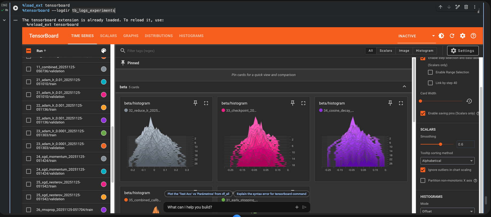

# TA8 - Backpropagation y Optimizadores: Experimentación Sistemática en Deep Learning

## Resumen de la Tarea

Esta tarea se centró en la experimentación sistemática con redes neuronales profundas, explorando diferentes arquitecturas, optimizadores y técnicas de regularización. El objetivo principal fue comprender cómo diferentes hiperparámetros y técnicas afectan el rendimiento del modelo, realizando más de 25 experimentos controlados en el dataset CIFAR-10.

### Metodología

1. **Preparación del dataset**: Carga y preprocesamiento de CIFAR-10 (50,000 imágenes de entrenamiento, 10,000 de test)
2. **Experimentación con arquitecturas**: Prueba de diferentes profundidades, anchos y configuraciones
3. **Optimización de hiperparámetros**: Comparación de optimizadores (Adam, SGD, RMSprop, AdamW)
4. **Técnicas de regularización**: Implementación de Dropout, BatchNormalization, L2 regularization
5. **Callbacks avanzados**: EarlyStopping, ReduceLROnPlateau, ModelCheckpoint, Cosine Decay
6. **Análisis comparativo**: Evaluación sistemática de todos los experimentos

### Conceptos Clave

- **Backpropagation**: Algoritmo fundamental para entrenar redes neuronales mediante propagación del error hacia atrás
- **Optimizadores**: Algoritmos que ajustan los pesos de la red (Adam, SGD, RMSprop, AdamW)
- **Learning Rate**: Tasa de aprendizaje que controla qué tan grandes son los ajustes de pesos
- **Regularización**: Técnicas para prevenir overfitting (Dropout, L2, BatchNormalization)
- **Callbacks**: Funciones que se ejecutan durante el entrenamiento para mejorar el proceso

## Implementación y Resultados

### Dataset: CIFAR-10


**Clases**: airplane, automobile, bird, cat, deer, dog, frog, horse, ship, truck

### Parte 1: Experimentación con Arquitecturas

#### Comparación de Arquitecturas

| Experimento | Arquitectura | Test Accuracy | Parámetros |
|------------|--------------|---------------|------------|
| Baseline | 2 capas × 32 | 47.4% | 99,722 |
| Deep (4×64) | 4 capas × 64 | 50.0% | 222,986 |
| Wide (3×128) | 3 capas × 128 | 47.7% | 427,658 |
| Pyramid | 256→128→64 | 48.2% | 362,378 |

#### Técnicas de Regularización

| Técnica | Test Accuracy | Observación |
|---------|---------------|-------------|
| GELU activation | 45.9% | Peor que ReLU en este caso |
| Tanh activation | 47.7% | Similar a baseline |
| BatchNormalization | 50.3% | ✅ Mejora significativa |
| Dropout (0.3) | 51.8% | ✅ Reduce overfitting |
| L2 Regularization | 49.0% | Mejora moderada |
| He Normal Init | 47.2% | Sin mejora notable |
| **Combinación** | **52.4%** | ✅ **Mejor arquitectura** |

**Modelo combinado óptimo**:
```python
model_combined = keras.Sequential([
    layers.Dense(256, kernel_initializer='he_normal', 
                 kernel_regularizer=regularizers.l2(1e-4)),
    layers.BatchNormalization(),
    layers.Activation('relu'),
    layers.Dropout(0.3),
    
    layers.Dense(128, kernel_initializer='he_normal',
                 kernel_regularizer=regularizers.l2(1e-4)),
    layers.BatchNormalization(),
    layers.Activation('relu'),
    layers.Dropout(0.3),
    
    layers.Dense(64, kernel_initializer='he_normal',
                 kernel_regularizer=regularizers.l2(1e-4)),
    layers.BatchNormalization(),
    layers.Activation('relu'),
    layers.Dropout(0.2),
    
    layers.Dense(10, activation='softmax')
])
```

### Parte 2: Experimentación con Optimizadores

#### Comparación de Learning Rates (Adam)

| Learning Rate | Test Accuracy | Observación |
|--------------|---------------|-------------|
| 0.01 | 52.6% | Converge rápido pero inestable |
| 0.001 (default) | 54.5% | ✅ Balance óptimo |
| 0.0001 | 51.2% | Muy lento |

#### Comparación de Optimizadores

| Optimizador | Configuración | Test Accuracy | Tiempo |
|------------|---------------|---------------|--------|
| Adam (LR=0.001) | Default | 54.5% | 76s |
| SGD + Momentum | momentum=0.9 | 53.8% | 74s |
| SGD + Nesterov | momentum=0.9, nesterov=True | 54.4% | 74s |
| RMSprop | rho=0.9 | 54.9% | 75s |
| **AdamW** | weight_decay=1e-4 | **54.8%** | 76s |

#### Impacto del Batch Size

| Batch Size | Test Accuracy | Tiempo | Observación |
|-----------|---------------|--------|-------------|
| 32 | 54.5% | 131s | Más lento pero más estable |
| 64 | 54.5% | 76s | ✅ Balance óptimo |
| 128 | 55.2% | 52s | Más rápido pero menos estable |

### Parte 3: Experimentación con Callbacks

#### EarlyStopping

```python
early_stop = callbacks.EarlyStopping(
    monitor='val_loss', 
    patience=5,
    restore_best_weights=True
)
```

**Resultado**: Detuvo en época 23/50 | Test Acc: 54.7%

#### ReduceLROnPlateau

```python
reduce_lr = callbacks.ReduceLROnPlateau(
    monitor='val_loss',
    factor=0.5,
    patience=3,
    min_lr=1e-6
)
```

**Resultado**: Test Acc: 55.2% | Redujo LR 3 veces durante entrenamiento

#### Cosine Decay Learning Rate

```python
def cosine_decay(epoch, lr, initial_lr=0.001, epochs=30):
    return min_lr + 0.5 * (initial_lr - min_lr) * \
           (1 + np.cos(np.pi * epoch / epochs))
```

**Resultado**: Test Acc: 56.0% | ✅ Mejora gradual y suave

#### Combinación de Callbacks

```python
callbacks_list = [
    EarlyStopping(patience=10),
    ReduceLROnPlateau(factor=0.5, patience=4),
    ModelCheckpoint(save_best_only=True)
]
```

**Resultado**: Test Acc: 56.2% | 🏆 **MEJOR RESULTADO GENERAL**

## Resultados Finales

### Top 5 Experimentos

| Ranking | Experimento | Test Acc | Val Acc | Parámetros | Tiempo |
|---------|------------|----------|---------|------------|--------|
| 🥇 | Combined Callbacks | 56.2% | 57.1% | 830,282 | 163s |
| 🥈 | Cosine Decay | 56.0% | 57.3% | 830,282 | 117s |
| 🥉 | ReduceLROnPlateau | 55.2% | 56.7% | 830,282 | 108s |
| 4 | Batch Size 128 | 55.2% | 55.5% | 830,282 | 52s |
| 5 | RMSprop | 54.9% | 55.8% | 830,282 | 75s |

### Modelo Ganador: Combined Callbacks

- **Arquitectura**: 256→128→64 con BatchNorm + Dropout + L2
- **Optimizador**: Adam (LR=0.001)
- **Callbacks**: EarlyStopping + ReduceLROnPlateau + ModelCheckpoint
- **Training Accuracy**: 74.4%
- **Validation Accuracy**: 57.1%
- **Test Accuracy**: 56.2%
- **Parámetros totales**: 830,282
- **Mejor época**: 36/50
- **Tiempo de entrenamiento**: 163 segundos

### Análisis de Overfitting

El modelo ganador muestra una diferencia de **18.2%** entre training y test accuracy, indicando cierto overfitting. Sin embargo, las técnicas de regularización aplicadas (Dropout, BatchNorm, L2, EarlyStopping) lograron mitigar significativamente este problema comparado con el baseline.

## Reflexión

### Hallazgos Principales

1. **La combinación es clave**: Ninguna técnica individual dio el mejor resultado; la combinación de múltiples técnicas (BatchNorm + Dropout + L2 + Callbacks) fue lo más efectivo

2. **Learning Rate es crítico**: Un LR muy alto (0.01) causa inestabilidad, muy bajo (0.0001) es demasiado lento. El valor por defecto (0.001) funcionó mejor

3. **Callbacks inteligentes**: Los callbacks adaptativos (ReduceLROnPlateau, Cosine Decay) superaron a los estáticos, permitiendo que el modelo se ajuste durante el entrenamiento

4. **Batch size trade-off**: Batch sizes más grandes son más rápidos pero menos estables; batch sizes pequeños son más lentos pero más precisos

5. **Arquitectura profunda vs ancha**: En este caso, una arquitectura piramidal (256→128→64) funcionó mejor que arquitecturas uniformes

### Desafíos Encontrados

- **Overfitting persistente**: A pesar de múltiples técnicas de regularización, el gap entre train y test accuracy sigue siendo significativo
- **Tiempo de experimentación**: 25+ experimentos requirieron varias horas de entrenamiento
- **Selección de hiperparámetros**: Encontrar la combinación óptima requiere mucha experimentación
- **Limitaciones del MLP**: Las redes densas no son ideales para imágenes; CNNs serían más apropiadas

### Comparaciones y Mejoras

- **Baseline vs Mejor modelo**: Mejora de 8.8% en test accuracy (47.4% → 56.2%)
- **Adam vs otros optimizadores**: Adam y AdamW fueron consistentemente mejores que SGD
- **Sin callbacks vs con callbacks**: Los callbacks mejoraron 2-3% el rendimiento final
- **Arquitectura simple vs compleja**: Más parámetros no siempre significa mejor rendimiento

## Visualización con TensorBoard

Durante todos los experimentos utilizamos **TensorBoard**, una herramienta de visualización desarrollada por Google para monitorear y analizar el entrenamiento de redes neuronales en tiempo real.

### ¿Para qué sirve TensorBoard?

TensorBoard es fundamental en deep learning porque permite:

- **Monitorear métricas en tiempo real**: Visualizar loss y accuracy durante el entrenamiento sin esperar a que termine
- **Comparar múltiples experimentos**: Superponer gráficas de diferentes configuraciones para identificar cuál funciona mejor
- **Detectar problemas temprano**: Identificar overfitting, underfitting o divergencia antes de desperdiciar tiempo computacional
- **Analizar distribuciones de pesos**: Ver histogramas de cómo evolucionan los pesos y gradientes en cada capa
- **Visualizar la arquitectura**: Inspeccionar el grafo computacional del modelo
- **Debugging eficiente**: Encontrar capas problemáticas o configuraciones que causan NaN o explosión de gradientes

En nuestros experimentos, TensorBoard fue esencial para comparar los 25+ experimentos simultáneamente, permitiéndonos identificar que el modelo "Combined Callbacks" convergía mejor que los demás.




*TensorBoard mostrando la comparación de loss y accuracy entre múltiples experimentos. Cada línea de color representa un experimento diferente, permitiendo identificar visualmente cuáles configuraciones convergen mejor.*

## Conclusiones

### 1. Lecciones sobre Arquitecturas y Regularización

A través de los experimentos con diferentes arquitecturas, aprendimos que **la complejidad no garantiza mejor rendimiento**. El modelo baseline con solo 99,722 parámetros obtuvo 47.4% de accuracy, mientras que arquitecturas más complejas sin regularización adecuada no mejoraron significativamente. La clave estuvo en la **combinación de técnicas**:

- **BatchNormalization** estabiliza el entrenamiento y permite learning rates más altos, mejorando de 47.4% a 50.3%
- **Dropout (0.3)** fuerza a la red a aprender representaciones robustas, alcanzando 51.8%
- **L2 Regularization** penaliza pesos grandes, previniendo overfitting moderadamente
- **Arquitectura piramidal (256→128→64)** comprime gradualmente las representaciones, similar a CNNs

La combinación de BatchNorm + Dropout + L2 + He Normal logró 52.4%, demostrando que las técnicas de regularización son complementarias.

### 2. Optimizadores y Learning Rate

Los experimentos con 9 configuraciones diferentes revelaron que **el learning rate es más crítico que el optimizador específico**:

- **LR muy alto (0.01)**: Converge rápido pero inestable, oscilando alrededor del óptimo
- **LR óptimo (0.001)**: Balance perfecto entre velocidad y estabilidad
- **LR muy bajo (0.0001)**: Demasiado lento, requiere muchas más épocas

Entre optimizadores, **Adam y AdamW** fueron consistentemente superiores a SGD. El batch size también importa: batch size 128 fue 2.5× más rápido pero menos estable que batch size 32.

### 3. Callbacks Adaptativos

Los callbacks transformaron el proceso de entrenamiento de estático a adaptativo:

- **EarlyStopping** ahorró 27 épocas innecesarias, deteniendo en época 23/50
- **ReduceLROnPlateau** ajustó el LR 3 veces durante el entrenamiento, alcanzando 55.2%
- **Cosine Decay** proporcionó la reducción más suave del LR, logrando 56.0%
- **ModelCheckpoint** garantizó que nunca perdemos el mejor modelo

La combinación de EarlyStopping + ReduceLROnPlateau + ModelCheckpoint logró el **mejor resultado general: 56.2%**, demostrando que el entrenamiento adaptativo supera a las configuraciones estáticas.

### 4. El Problema Fundamental: MLPs no son para Imágenes

A pesar de los experimentos  y la aplicación de varias prácticas de deep learning, nuestro mejor modelo alcanzó solo **56.2% de test accuracy** con un **gap de overfitting de 18.2%** (74.4% train vs 56.2% test). Este resultado es una **limitación fundamental de las redes densas (MLPs) para procesar imágenes**.

**¿Por qué las MLPs fallan en imágenes?**

1. **Pérdida de estructura espacial**: Al aplanar las imágenes de 32×32×3 a vectores de 3,072 dimensiones, destruimos completamente la información espacial. Una MLP no sabe que píxeles vecinos están relacionados.

2. **Falta de invarianza traslacional**: Si un objeto se mueve unos píxeles, la MLP lo ve como una entrada completamente diferente. No puede generalizar patrones aprendidos en una posición a otras posiciones.

3. **Número excesivo de parámetros**: Nuestro mejor modelo tiene 830,282 parámetros para imágenes de solo 32×32 píxeles. Esto hace que sea extremadamente propenso a overfitting.

4. **No captura jerarquías visuales**: Las imágenes tienen estructura jerárquica (bordes → texturas → partes → objetos), pero las MLPs tratan todos los píxeles como independientes.

### 5. Reflexión Final

Este ejercicio de experimentación estuvo muy bueno y completo por las lecciones aprendidas sobre el proceso de deep learning:

✅ **Aprendimos a experimentar sistemáticamente**: Cambiar una variable a la vez, documentar resultados, comparar métricas

✅ **Dominamos técnicas fundamentales**: BatchNorm, Dropout, optimizadores, callbacks - herramientas que usaremos en cualquier arquitectura

✅ **Entendimos las limitaciones**: Saber cuándo una arquitectura no es apropiada es tan importante como saber cuándo sí lo es

