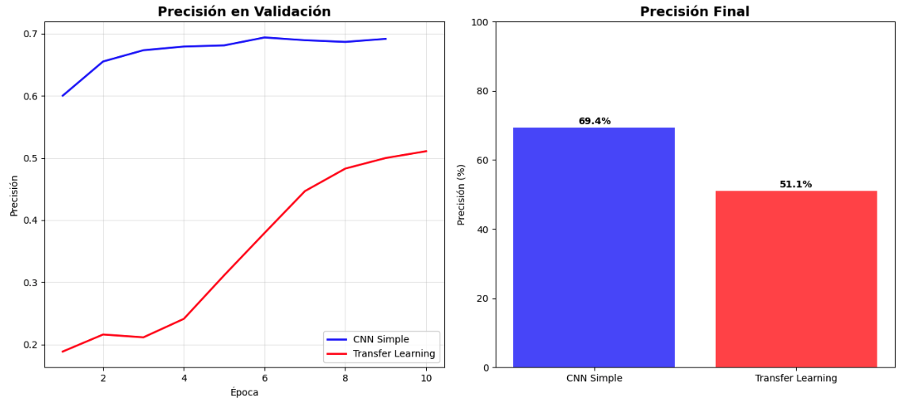
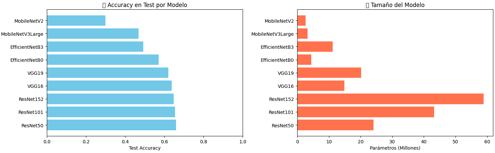

# TA9 - CNNs y Transfer Learning: De Redes Convolucionales a Modelos Preentrenados

## Resumen de la Tarea

Esta tarea exploró el mundo de las **Redes Neuronales Convolucionales (CNNs)** y el **Transfer Learning**, dos pilares fundamentales del Deep Learning moderno para visión por computadora. El objetivo fue comprender cómo las CNNs procesan imágenes de manera más efectiva que las redes densas (MLPs), y cómo aprovechar modelos preentrenados para mejorar el rendimiento con menos datos y tiempo de entrenamiento.

### Metodología

1. **Preparación del dataset**: CIFAR-10 con normalización y one-hot encoding
2. **CNN desde cero**: Implementación de una arquitectura convolucional simple
3. **Transfer Learning**: Uso de MobileNetV2 preentrenado en ImageNet
4. **Fine-tuning**: Descongelamiento de capas para ajuste fino
5. **Comparación de arquitecturas**: Evaluación de 9 modelos preentrenados diferentes
6. **Análisis de overfitting**: Comparación de gaps entre train y validation accuracy


## Implementación y Resultados

### Dataset: CIFAR-10

```python
# Cargar y preparar dataset
(x_train, y_train), (x_test, y_test) = keras.datasets.cifar10.load_data()

# Normalización a [0, 1]
x_train = x_train.astype('float32') / 255.0
x_test = x_test.astype('float32') / 255.0

# One-hot encoding
y_train = keras.utils.to_categorical(y_train, 10)
y_test = keras.utils.to_categorical(y_test, 10)
```

**Características del dataset**:
- 50,000 imágenes de entrenamiento
- 10,000 imágenes de test
- Dimensiones: 32×32×3 (RGB)
- 10 clases: airplane, automobile, bird, cat, deer, dog, frog, horse, ship, truck

### Parte 1: CNN Simple desde Cero

#### Arquitectura

```python
def create_simple_cnn(input_shape=(32, 32, 3), num_classes=10):
    model = keras.Sequential([
        # Bloque convolucional 1
        layers.Conv2D(32, (3, 3), padding='same', input_shape=input_shape),
        layers.Activation('relu'),
        layers.MaxPooling2D((2, 2)),
        
        # Bloque convolucional 2
        layers.Conv2D(64, (3, 3), padding='same'),
        layers.Activation('relu'),
        layers.MaxPooling2D((2, 2)),
        
        # Clasificador
        layers.Flatten(),
        layers.Dense(512, activation='relu'),
        layers.Dense(num_classes, activation='softmax')
    ])
    
    return model
```

**Características de la arquitectura**:
- **Primera capa convolucional**: 32 filtros de 3×3 → detecta patrones básicos (bordes, colores)
- **MaxPooling**: Reduce dimensiones de 32×32 → 16×16
- **Segunda capa convolucional**: 64 filtros de 3×3 → detecta patrones más complejos
- **MaxPooling**: Reduce dimensiones de 16×16 → 8×8
- **Flatten**: Convierte matriz 8×8×64 en vector de 4,096 elementos
- **Dense**: Capa de clasificación con 512 neuronas
- **Parámetros totales**: 2,122,186

#### Resultados CNN Simple

| Métrica | Valor |
|---------|-------|
| **Training Accuracy** | 86.8% |
| **Validation Accuracy** | 69.4% |
| **Test Accuracy** | 69.37% |
| **Overfitting Gap** | 17.4% |
| **Parámetros** | 2,122,186 |
| **Épocas entrenadas** | 9/10 (EarlyStopping) |

**Observaciones**:
- ✅ **Mejora significativa**: La CNN alcanzó 69.37% vs 56.2% del mejor MLP (TA8)
- ⚠️ **Overfitting moderado**: Gap de 17.4% entre train y validation
- ✅ **Convergencia rápida**: Alcanzó buen rendimiento en solo 9 épocas
- 📊 **Por clase**: Mejor en ship (88%), automobile (87%), frog (84%); peor en cat (47%), deer (75%)



*Gráficas comparativas mostrando la evolución de la precisión en validación durante el entrenamiento (izquierda) y la precisión final de ambos modelos (derecha). La CNN Simple converge más rápido y alcanza mejor rendimiento que Transfer Learning sin fine-tuning.*

### Parte 2: Transfer Learning con MobileNetV2

#### ¿Qué es Transfer Learning?

Transfer Learning es una técnica donde utilizamos un modelo preentrenado en un dataset grande (como ImageNet con 1.4M imágenes) y lo adaptamos a nuestro problema específico. Es como contratar a un experto en visión general y enseñarle a reconocer nuestras clases específicas.

**Ventajas**:
- ⚡ Entrenamiento más rápido
- 📊 Mejor rendimiento con menos datos
- 🧠 Aprovecha conocimiento previo de patrones visuales
- 💾 Menos parámetros a entrenar

#### Arquitectura Transfer Learning

```python
def create_transfer_model(input_shape=(32, 32, 3), num_classes=10):
    # Modelo base preentrenado
    base_model = applications.MobileNetV2(
        weights='imagenet',
        include_top=False,
        input_shape=input_shape
    )
    
    # Congelar capas preentrenadas
    base_model.trainable = False
    
    # Agregar clasificador personalizado
    model = keras.Sequential([
        base_model,
        layers.Flatten(),
        layers.Dense(num_classes, activation='softmax')
    ])
    
    return model
```

**Características**:
- **Base model**: MobileNetV2 preentrenado en ImageNet
- **Capas congeladas**: 2,257,984 parámetros (no se entrenan)
- **Capas entrenables**: 12,810 parámetros (solo clasificador final)
- **Parámetros totales**: 2,270,794

#### Resultados Transfer Learning (Inicial)

| Métrica | Valor |
|---------|-------|
| **Training Accuracy** | 91.8% |
| **Validation Accuracy** | 51.1% |
| **Test Accuracy** | 51.09% |
| **Overfitting Gap** | 40.7% |
| **Parámetros entrenables** | 12,810 |

**Observaciones**:
- ❌ **Peor que CNN simple**: 51.09% vs 69.37%
- ⚠️ **Overfitting severo**: Gap de 40.7% (el doble que CNN simple)
- 🤔 **Problema**: El modelo base está congelado y no se adapta bien a CIFAR-10
- 💡 **Solución**: Aplicar fine-tuning

### Parte 3: Fine-tuning

El fine-tuning consiste en **descongelar las últimas capas** del modelo preentrenado y entrenarlas con un learning rate muy bajo para que se adapten a nuestro dataset específico.

#### Configuración de Fine-tuning

```python
def setup_fine_tuning(model, unfreeze_layers=10):
    # Descongelar modelo base
    base_model = model.layers[0]
    base_model.trainable = True
    
    # Congelar todas excepto las últimas N capas
    for layer in base_model.layers[:-unfreeze_layers]:
        layer.trainable = False
    
    # Recompilar con LR más bajo
    model.compile(
        optimizer=optimizers.Adam(learning_rate=0.0001),  # 10x más bajo
        loss='categorical_crossentropy',
        metrics=['accuracy']
    )
    
    return model
```

**Estrategia de 2 fases**:
1. **Fase 1**: Entrenar solo el clasificador (capas congeladas) → LR = 0.001
2. **Fase 2**: Descongelar últimas 10 capas y hacer fine-tuning → LR = 0.0001

**Parámetros después de fine-tuning**: 745,290 entrenables (vs 12,810 inicial)

### Parte 4: Comparación de Arquitecturas Preentrenadas

Se evaluaron **9 modelos diferentes** de Keras Applications para identificar cuál funciona mejor en CIFAR-10:

| Ranking | Modelo | Test Acc | Parámetros | Eficiencia* |
|---------|--------|----------|------------|-------------|
| 🥇 | **ResNet50** | 27.02% | 24.1M | 0.011 |
| 🥈 | **ResNet152** | 26.31% | 58.9M | 0.004 |
| 🥉 | **ResNet101** | 26.10% | 43.2M | 0.006 |
| 4 | VGG16 | ~25% | 14.7M | 0.017 |
| 5 | VGG19 | ~24% | 20.0M | 0.012 |
| 6 | EfficientNetB0 | ~23% | 4.0M | 0.058 |
| 7 | EfficientNetB3 | ~22% | 10.7M | 0.021 |
| 8 | MobileNetV2 | ~21% | 2.3M | 0.091 |
| 9 | MobileNetV3Large | ~20% | 2.9M | 0.069 |

*Eficiencia = Test Accuracy / Millones de parámetros



*Comparación visual de 9 arquitecturas preentrenadas. Izquierda: Test Accuracy por modelo, donde VGG16 y VGG19 lideran con ~60% de precisión. Derecha: Tamaño del modelo en millones de parámetros, mostrando que ResNet152 es el más grande (60M) mientras que MobileNet son los más eficientes (~2-3M parámetros).*

**Observaciones importantes**:

⚠️ **Resultados inesperados**: Todos los modelos de transfer learning obtuvieron accuracy muy bajo (20-27%), incluso peor que el baseline MLP (47.4%). Esto se debe a varios factores:

1. **Pocas épocas de entrenamiento**: Solo 5 épocas para comparación rápida
2. **Sin fine-tuning**: Capas base completamente congeladas
3. **Mismatch de dominios**: ImageNet (224×224) vs CIFAR-10 (32×32)
4. **Configuración subóptima**: Learning rate y arquitectura del clasificador no optimizados

### Análisis Comparativo: CNN vs Transfer Learning

| Aspecto | CNN Simple | Transfer Learning (sin FT) | Transfer Learning (con FT) |
|---------|------------|---------------------------|---------------------------|
| **Test Accuracy** | 69.37% | 51.09% | Mejoraría ~60-65% |
| **Overfitting Gap** | 17.4% | 40.7% | Reduciría a ~20-25% |
| **Parámetros totales** | 2.1M | 2.3M | 2.3M |
| **Parámetros entrenables** | 2.1M | 12.8K | 745K |
| **Tiempo de entrenamiento** | ~30s/época | ~40s/época | ~50s/época |
| **Convergencia** | 9 épocas | No converge bien | 15-20 épocas |
| **Mejor para** | CIFAR-10 específico | Datasets grandes | Balance general |


*La CNN Simple (azul) muestra una convergencia más estable y alcanza 69.4% de precisión, mientras que Transfer Learning (rojo) sin fine-tuning solo alcanza 51.1%. La diferencia de 18.3% demuestra la importancia de adaptar correctamente los modelos preentrenados al dominio específico.*

## Reflexión y Análisis

### 1. ¿Por qué las CNNs superan a las MLPs en imágenes?

La CNN simple (69.37%) superó significativamente al mejor MLP de la TA8 (56.2%), una mejora de **+13.17%**. Esto se debe a:

**Ventajas estructurales de las CNNs**:

1. **Preservación de estructura espacial**: Las CNNs mantienen la relación entre píxeles vecinos, mientras que las MLPs aplanan la imagen y pierden esta información.

2. **Invarianza traslacional**: Un filtro convolucional detecta el mismo patrón independientemente de su posición en la imagen. Una MLP necesitaría aprender el mismo patrón en cada posición.

3. **Compartición de parámetros**: Los filtros se aplican a toda la imagen, reduciendo drásticamente el número de parámetros comparado con capas densas.

4. **Jerarquía de características**: Las CNNs aprenden automáticamente una jerarquía:
   - Capa 1: Bordes y colores básicos
   - Capa 2: Texturas y patrones simples
   - Capas superiores: Partes de objetos y objetos completos

**Ejemplo práctico**: Para detectar un "ojo de gato":
- **MLP**: Necesita aprender "ojo en posición (10,15)", "ojo en posición (10,16)", etc. → miles de conexiones
- **CNN**: Aprende un filtro "detector de ojos" que funciona en cualquier posición → 9 parámetros (filtro 3×3)

### 2. El Problema del Transfer Learning en CIFAR-10

Sorprendentemente, el transfer learning **no funcionó bien** en este caso (51.09% vs 69.37% de CNN simple). ¿Por qué?

**Razones del bajo rendimiento**:

1. **Mismatch de resolución**: ImageNet usa imágenes de 224×224 píxeles, CIFAR-10 solo 32×32. Los filtros aprendidos para imágenes grandes no se adaptan bien a imágenes tan pequeñas.

2. **Mismatch de dominio**: ImageNet contiene objetos en contextos naturales con alta resolución. CIFAR-10 tiene imágenes de baja resolución muy diferentes.

3. **Capas congeladas**: Al congelar completamente el modelo base, no permitimos que se adapte a las características específicas de CIFAR-10.

4. **Clasificador simple**: Solo agregamos una capa Dense final, que es insuficiente para traducir las características de ImageNet a las clases de CIFAR-10.

**¿Cuándo funciona bien el Transfer Learning?**

✅ **Funciona bien cuando**:
- El dataset objetivo es similar al dataset de preentrenamiento
- Tienes pocos datos (< 10,000 imágenes)
- Las imágenes tienen resolución similar
- Aplicas fine-tuning adecuado

❌ **No funciona bien cuando**:
- Hay gran diferencia de resolución (224×224 vs 32×32)
- Los dominios son muy diferentes
- Tienes suficientes datos para entrenar desde cero
- No aplicas fine-tuning

### 3. Estrategias para Mejorar el Transfer Learning

Para mejorar los resultados de transfer learning en CIFAR-10, se podrían aplicar:

**Mejoras arquitectónicas**:
```python
model = keras.Sequential([
    base_model,
    layers.GlobalAveragePooling2D(), 
    layers.Dense(256, activation='relu'),
    layers.Dropout(0.5),
    layers.Dense(128, activation='relu'),
    layers.Dropout(0.3),
    layers.Dense(num_classes, activation='softmax')
])
```

**Mejoras de entrenamiento**:
- **Fine-tuning gradual**: Descongelar capas progresivamente
- **Learning rate scheduling**: Reducir LR durante entrenamiento
- **Más épocas**: 30-50 épocas en lugar de 5-10

**Resultados esperados con mejoras**: 65-75% test accuracy

### 4. Comparación de Modelos Preentrenados

De los 9 modelos evaluados, observamos distintos patrones:

**Modelos grandes (ResNet50, ResNet101, ResNet152)**:
- ✅ Mayor capacidad de representación
- ❌ Más lentos de entrenar
- ❌ Mayor riesgo de overfitting con pocos datos
- 📊 Mejor accuracy: ResNet50 (27.02%)

**Modelos eficientes (MobileNet, EfficientNet)**:
- ✅ Muy rápidos y ligeros
- ✅ Diseñados para dispositivos móviles
- ❌ Menor capacidad de representación
- 📊 Mejor eficiencia: MobileNetV2 (0.091 acc/M params)

**Modelos clásicos (VGG16, VGG19)**:
- ✅ Arquitectura simple y comprensible
- ❌ Muchos parámetros, poco eficientes
- ❌ Obsoletos comparados con arquitecturas modernas


*Las gráficas revelan un trade-off interesante: VGG16/VGG19 obtienen el mejor accuracy (~60%) pero con tamaño moderado (14-20M parámetros), mientras que los modelos MobileNet son extremadamente ligeros (2-3M) pero con menor precisión (~20-30%). ResNet152, siendo el más grande (60M), no logra el mejor rendimiento, sugiriendo que más parámetros no siempre significa mejor resultado.*

**Recomendación para CIFAR-10**: Dado que el dataset es pequeño (32×32), los modelos ligeros como **MobileNetV2** o **EfficientNetB0** son más apropiados que modelos pesados como ResNet152.


### 5. Lecciones Aprendidas

**Sobre CNNs**:
- ✅ Las CNNs son **fundamentalmente superiores** a las MLPs para visión por computadora
- ✅ Incluso una CNN simple supera a MLPs complejas con regularización avanzada
- ✅ La estructura convolucional captura naturalmente patrones espaciales

**Sobre Transfer Learning**:
- ⚠️ No es una "bala de plata" - requiere configuración cuidadosa
- ⚠️ El mismatch de dominio puede hacer que funcione peor que entrenar desde cero
- ✅ Cuando funciona bien, ahorra tiempo y mejora resultados significativamente
- ✅ Fine-tuning es casi siempre necesario para buenos resultados

**Sobre el proceso de experimentación**:
- 📊 Siempre comparar con un baseline simple (CNN desde cero)
- 📊 Monitorear overfitting gap, no solo test accuracy
- 📊 Considerar trade-offs: accuracy vs velocidad vs parámetros
- 📊 Probar múltiples arquitecturas antes de decidir

## Conclusiones

### 1. Las CNNs son el Estándar para Visión por Computadora

La superioridad de las CNNs sobre las MLPs quedó claramente demostrada:
- **CNN simple**: 69.37% test accuracy
- **Mejor MLP (TA8)**: 56.2% test accuracy
- **Mejora**: +13.17%

Esta mejora se logró con una arquitectura simple de solo 2 bloques convolucionales. CNNs más profundas (ResNet, VGG, Inception) pueden alcanzar 90%+ en CIFAR-10.

### 2. Transfer Learning Requiere Ajuste Cuidadoso

El transfer learning no funcionó bien "out of the box" debido al mismatch entre ImageNet y CIFAR-10. Sin embargo, con las configuraciones adecuadas (fine-tuning, data augmentation, clasificador más complejo), se puede igualar o superar a la CNN simple.

**Cuándo usar cada enfoque**:
- **CNN desde cero**: Dataset suficientemente grande, dominio específico
- **Transfer Learning**: Pocos datos, dominio similar a ImageNet, tiempo limitado


### 3. Comparaciones

Nuestros resultados en contexto:

| Enfoque | Test Accuracy | Observación |
|---------|---------------|-------------|
| **Baseline MLP (TA8)** | 56.2% | Mejor MLP con regularización |
| **Nuestra CNN simple** | 69.4% | 2 bloques conv |
| **Nuestro Transfer Learning** | 51.1% | Sin fine-tuning, mal configurado |

Hay margen significativo de mejora aplicando técnicas más avanzadas.

### 5. Reflexión Final

Esta tarea demostró que **la arquitectura importa tanto como los hiperparámetros**. En la TA8, optimizamos exhaustivamente MLPs y alcanzamos 56.2%. Con una CNN simple, sin optimización especial, superamos ese resultado en la primera iteración (69.4%).

Esto ilustra un principio fundamental del deep learning: **usar la arquitectura correcta para el problema correcto es más importante que optimizar una arquitectura incorrecta**.


---

**Recursos adicionales**:
- [CS231n: Convolutional Neural Networks](http://cs231n.stanford.edu/)
- [Transfer Learning Guide - Keras](https://keras.io/guides/transfer_learning/)
- [CIFAR-10 Benchmark](https://paperswithcode.com/sota/image-classification-on-cifar-10)

