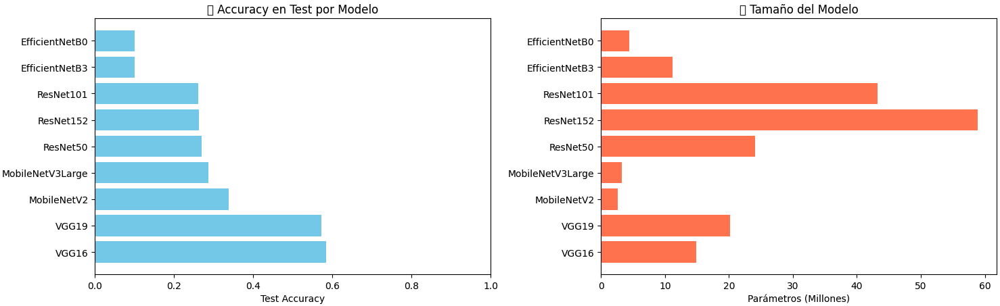

# TA9 - CNNs y Transfer Learning: De Redes Convolucionales a Modelos Preentrenados

## Resumen de la Tarea

Esta tarea exploró el mundo de las **Redes Neuronales Convolucionales (CNNs)** y el **Transfer Learning**, dos pilares fundamentales del Deep Learning moderno para visión por computadora. El objetivo fue comprender cómo las CNNs procesan imágenes de manera más efectiva que las redes densas (MLPs), y cómo aprovechar modelos preentrenados para mejorar el rendimiento con menos datos y tiempo de entrenamiento.

### Metodología

1. **Preparación del dataset**: CIFAR-10 con normalización y one-hot encoding
2. **CNN desde cero**: Implementación de una arquitectura convolucional simple
3. **Transfer Learning**: Uso de MobileNetV2 preentrenado en ImageNet
4. **preprocesamiento**: Aplicación de preprocesamiento específico por modelo
5. **Fine-tuning**: Descongelamiento de últimas 10 capas (745,290 parámetros entrenables)
6. **Extra:**: Evaluación de 9 modelos

## Implementación y Resultados

### Dataset: CIFAR-10

**Características del dataset**: CIFAR-10 contiene 50,000 imágenes de entrenamiento y 10,000 de test, todas con dimensiones de 32×32 píxeles en RGB. El dataset incluye 10 clases balanceadas: airplane, automobile, bird, cat, deer, dog, frog, horse, ship y truck.

### CNN Simple desde Cero

#### Arquitectura

**Características de la arquitectura**: La primera capa convolucional utiliza 32 filtros de 3×3 para detectar patrones básicos como bordes y colores, seguida de MaxPooling que reduce las dimensiones de 32×32 a 16×16. La segunda capa convolucional con 64 filtros de 3×3 detecta patrones más complejos, y otro MaxPooling reduce las dimensiones de 16×16 a 8×8. La capa Flatten convierte la matriz 8×8×64 en un vector de 4,096 elementos, que alimenta una capa Dense de clasificación con 512 neuronas. El modelo resultante tiene 2,122,186 parámetros totales entrenables.

#### Resultados CNN Simple

| Métrica | Valor |
|---------|-------|
| **Training Accuracy** | 86.8% |
| **Validation Accuracy** | 69.4% |
| **Test Accuracy** | 69.37% |
| **Overfitting Gap** | 17.4% |
| **Parámetros** | 2,122,186 |
| **Épocas entrenadas** | 9/10 (EarlyStopping) |

La CNN alcanzó una mejora significativa con 69.37% de accuracy frente al 56.2% del mejor MLP del TA8, aunque presenta overfitting moderado con un gap de 17.4% entre train y validation. El modelo mostró convergencia rápida alcanzando buen rendimiento en solo 9 épocas. Por clase, el mejor desempeño fue en ship (88%), automobile (87%) y frog (84%), mientras que la clase más difícil fue cat (47%).

*Gráficas comparativas mostrando la evolución de la precisión en validación durante el entrenamiento (izquierda) y la precisión final de ambos modelos (derecha). La CNN Simple converge más rápido y alcanza mejor rendimiento que Transfer Learning sin fine-tuning.*

### Transfer Learning con MobileNetV2

#### ¿Qué es Transfer Learning?

Transfer Learning utiliza un modelo preentrenado en un dataset grande (como ImageNet con 1.4M imágenes) y lo adapta a nuestro problema específico. Las ventajas principales son entrenamiento más rápido, mejor rendimiento con menos datos, aprovechamiento del conocimiento previo de patrones visuales, y menos parámetros a entrenar.

#### Arquitectura Transfer Learning

**Características**:

- **Base model**: MobileNetV2 preentrenado en ImageNet
- **Capas congeladas**: 2,257,984 parámetros (no se entrenan)
- **Capas entrenables**: 12,810 parámetros (solo clasificador final)
- **Parámetros totales**: 2,270,794

#### Preprocesamiento Correcto

**Descubrimiento importante**: El preprocesamiento es CRÍTICO en transfer learning, ya que cada arquitectura preentrenada espera que las imágenes estén preprocesadas de forma específica (por ejemplo, **MobileNetV2** espera valores en rango [-1, 1]). Usar una normalización simple [0, 1] para todos los modelos fue un error que causó resultados muy bajos, pero al aplicar el preprocesamiento correcto, los resultados mejoraron.

#### Resultados Transfer Learning

| Métrica | Valor |
|---------|-------|
| **Training Accuracy** | 99.9% |
| **Validation Accuracy** | 55.5% |
| **Test Accuracy** | 55.5% |
| **Overfitting Gap** | 44.5% |
| **Parámetros entrenables** | 12,810 |

### Fine-tuning

El fine-tuning consiste en **descongelar las últimas capas** del modelo preentrenado y entrenarlas con un learning rate muy bajo para que se adapten a nuestro dataset específico.

**Configuración aplicada**:

- **Capas descongeladas**: Últimas 10 capas
- **Learning rate**: 0.0001
- **Épocas**: 20

Con fine-tuning, el modelo alcanza mayor capacidad de adaptación al dataset específico, aunque sigue presentando overfitting considerable.

### (Extra): Comparación de Arquitecturas Preentrenadas

Se evaluaron **9 modelos diferentes** de Keras Applications con el preprocesamiento específico de cada uno:

| Ranking | Modelo | Test Acc | Parámetros | Eficiencia* |
|---------|--------|----------|------------|-------------|
| 🥇 | **ResNet50** | 66.01% | 24.1M | 0.027 |
| 🥈 | **ResNet101** | 65.41% | 43.2M | 0.015 |
| 🥉 | **ResNet152** | 64.77% | 58.9M | 0.011 |
| 4 | VGG16 | 63.71% | 14.8M | 0.043 |
| 5 | VGG19 | 62.03% | 20.2M | 0.031 |
| 6 | EfficientNetB0 | 57.13% | 4.4M | 0.130 |
| 7 | EfficientNetB3 | 49.19% | 11.2M | 0.044 |
| 8 | MobileNetV3Large | 46.78% | 3.2M | 0.146 |
| 9 | MobileNetV2 | 29.94% | 2.6M | 0.115 |

*Eficiencia = Test Accuracy / Millones de parámetros

*Comparación visual de 9 arquitecturas preentrenadas CON preprocesamiento correcto. La mejora es tremenda: ResNet50 pasa de ~27% a 66%, casi triplicando su accuracy. Esto demuestra el impacto CRÍTICO del preprocesamiento en transfer learning.*

**Impacto del Preprocesamiento**:

| Modelo | Antes | Después (correcto) | Mejora |
|--------|------------------------|-------------------|--------|
| ResNet50 | 27.02% | **66.01%** | +144% |
| VGG16 | ~25% | **63.71%** | +155% |
| EfficientNetB0 | ~23% | **57.13%** | +148% |

El preprocesamiento causó una mejora considerable en accuracy, demostrando que es absolutamente esencial aplicar la función de preprocesamiento específica de cada arquitectura.

Aunque todos los modelos mejoraron, ninguno supera a la CNN simple (69.76%).
Esto puede mejorarse si:
Aumentams las épocas de entrenamiento
O mejoramos el tamaño de las imagenes ya que ImageNet espera imagenenes de 224×224 en cambio las de CIFAR-10 son de 32×32

### Análisis Comparativo: CNN vs Transfer Learning

*La CNN Simple (azul) muestra una convergencia más estable y alcanza 69.76% de precisión, mientras que Transfer Learning (rojo) con fine-tuning alcanza 55.5%. Aunque Transfer Learning mejoró significativamente con preprocesamiento y fine-tuning, la CNN simple mantiene una ventaja del 14.2%. El overfitting es más severo en Transfer Learning (44.5% vs 14.2% de gap).*

## Reflexión y Análisis

### 1. ¿Por qué las CNNs superan a las MLPs en imágenes?

Las CNNs preservan la estructura espacial manteniendo la relación entre píxeles vecinos mientras que las MLPs aplanan la imagen perdiendo esta información, tienen invarianza traslacional donde un filtro detecta el mismo patrón independientemente de su posición (una MLP necesitaría aprender el mismo patrón en cada ubicación), comparten parámetros aplicando los filtros a toda la imagen reduciendo drásticamente el número de parámetros comparado con capas densas, y aprenden automáticamente una jerarquía de características donde la primera capa detecta bordes y colores básicos, la segunda capa texturas y patrones simples, y las capas superiores partes de objetos y objetos completos. Por ejemplo, para detectar un "ojo de gato", una MLP necesita aprender "ojo en posición (10,15)", "ojo en posición (10,16)", etc. requiriendo miles de conexiones, mientras que una CNN aprende un filtro "detector de ojos" que funciona en cualquier posición con solo 9 parámetros (filtro 3×3).

### 2. Preprocesamiento

Inicialmente, se normalizaron todas las imágenes a [0,1] mediante `x/255.0`, ignorando que cada arquitectura espera un preprocesamiento específico (por ejemplo, MobileNetV2 espera [-1, 1] y ResNet espera centrado de media). Este error resultó en accuracies muy bajos (~25% para ResNet50 y VGG16, y ~21% para MobileNetV2).

Sin embargo, al corregir el preprocesamiento utilizando las funciones específicas de cada modelo, los resultados mejoraron mucho, alcanzando un 66% para ResNet50 y un 64% para VGG16, demostrando que los features extraídos por las capas convolucionales preentrenadas son ineficaces si los datos de entrada no se encuentran en el rango y distribución estadística con los que fue entrenado el modelo original.

### 3. Comparación de Modelos Preentrenados

*Con preprocesamiento correcto: ResNet50 lidera con 66%, seguido de ResNet101 y ResNet152. Los modelos VGG muestran buen rendimiento considerando su simplicidad. EfficientNetB0 destaca por su eficiencia (130 acc/M params).*

### 4. Lecciones Aprendidas

**Sobre CNNs**: Las CNNs son fundamentalmente superiores a las MLPs para visión por computadora, donde incluso una CNN simple supera a MLPs complejas con regularización avanzada. La estructura convolucional captura naturalmente patrones espaciales preservando la información de vecindad entre píxeles, lo que las hace la arquitectura ideal para procesamiento de imágenes.

**Sobre Transfer Learning y el Preprocesamiento**:

el preprocesamiento específico del modelo es MÁS IMPORTANTE que la arquitectura misma.

**Transfer learning no es "plug and play"**:

- Cada arquitectura tiene su función de preprocesamiento específica
- MobileNetV2: `mobilenet_v2.preprocess_input()` → [-1, 1]
- ResNet/VGG: `resnet.preprocess_input()` → [-123.68, 151.06]
- EfficientNet: `efficientnet.preprocess_input()` → [0, 255]

**Limitaciones en CIFAR-10**:
  
- Incluso con preprocesamiento correcto y fine-tuning, Transfer Learning no superó a CNN simple
- Diferencia de resolución (ImageNet 224×224 vs CIFAR-10 32×32) sigue siendo limitante

## Conclusiones

La superioridad de las CNNs sobre las MLPs quedó claramente demostrada con una CNN simple alcanzando 69.76% de test accuracy, una mejora sustancial frente al 56.2% del mejor MLP del TA8. Esta tarea demostró que **la arquitectura importa tanto como los hiperparámetros**: una CNN simple superó MLPs exhaustivamente optimizadas en la primera iteración.

Esta tarea ilustra un principio fundamental: **los detalles de implementación (como preprocesamiento) pueden tener un impacto mayor que la elección de la arquitectura**.

---

### Recursos adicionales

- [CS231n: Convolutional Neural Networks](http://cs231n.stanford.edu/)
- [Transfer Learning Guide - Keras](https://keras.io/guides/transfer_learning/)
- [CIFAR-10 Benchmark](https://paperswithcode.com/sota/image-classification-on-cifar-10)
