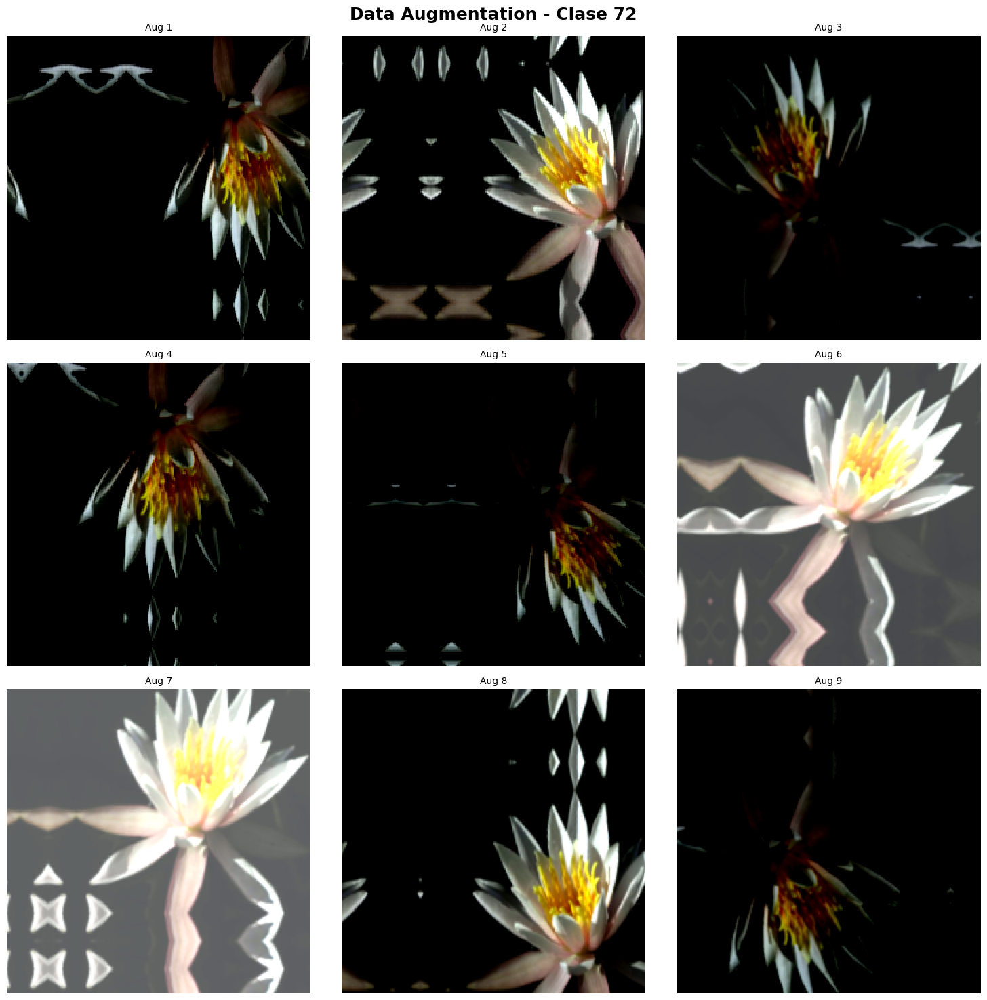
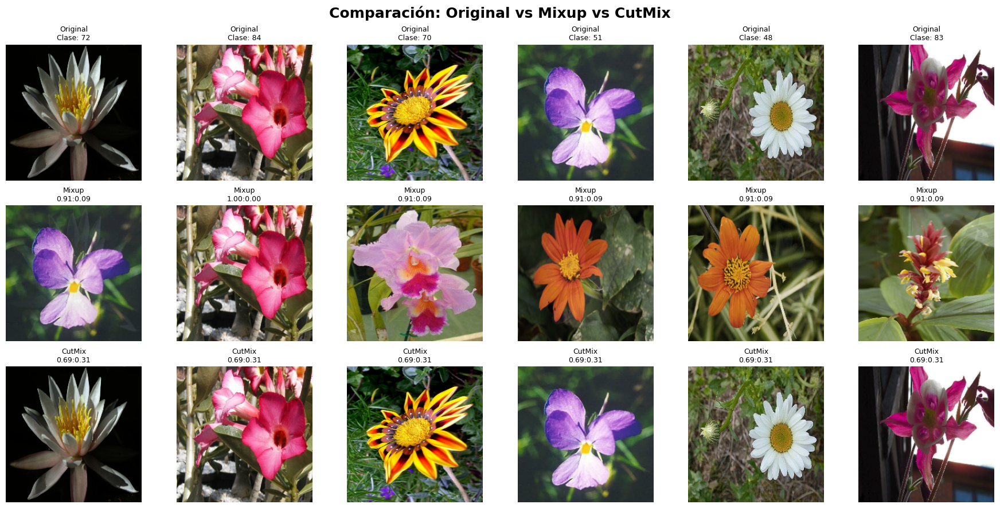
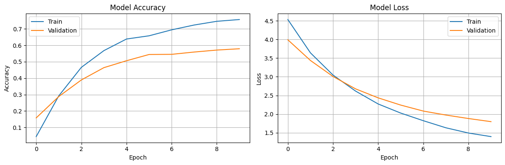
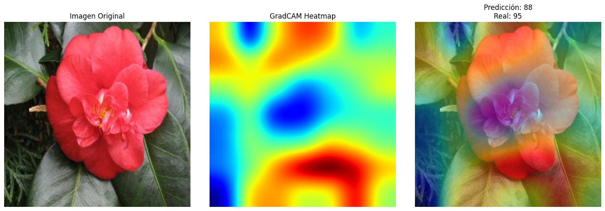

# TA10 - Data Augmentation y Explainable AI: Mejorando Modelos con Datos Sintéticos y Visualización de Decisiones

## Resumen de la Tarea

Esta tarea explaramos **Data Augmentation** (técnicas avanzadas para generar datos sintéticos de entrenamiento) y **Explainable AI (XAI)** (métodos para interpretar y visualizar las decisiones de redes neuronales). El objetivo fue comprender cómo mejorar el rendimiento de modelos con datos limitados y cómo hacer que las predicciones sean interpretables y confiables.

### Metodología

1. **Dataset**: Oxford Flowers102 con 102 clases de flores
2. **Pipelines de augmentation**: Baseline, Keras layers, Mixup y CutMix
3. **Transfer Learning**: EfficientNetB0 preentrenado en ImageNet
4. **Explainable AI**: GradCAM e Integrated Gradients para visualizar decisiones
5. **Comparación**: Evaluación del impacto de diferentes técnicas de augmentation

## Implementación y Resultados

### Dataset: Oxford Flowers102

```python
# Cargar dataset con TFDS
(ds_train, ds_test), ds_info = tfds.load(
    'oxford_flowers102',
    split=['train', 'test'],
    shuffle_files=True,
    as_supervised=True,
    with_info=True,
)
```

**Características del dataset**:
- 1,020 imágenes de entrenamiento
- 6,149 imágenes de test
- Dimensiones: Variable (redimensionadas a 224×224)
- 102 clases de flores diferentes
- **Desafío**: Dataset muy pequeño → augmentation es crítico

**Subset usado para práctica rápida**:
- Train: 5,000 imágenes
- Test: 1,000 imágenes

### Parte 1: Data Augmentation con Keras Layers

#### Pipeline Baseline (Sin Augmentation)

```python
def create_baseline_pipeline(dataset, batch_size=32, training=True):
    if training:
        dataset = dataset.shuffle(1000)
    
    dataset = dataset.batch(batch_size)
    
    def normalize_batch(images, labels):
        images = preprocess_input(images)  # EfficientNet preprocessing
        return images, labels
    
    dataset = dataset.map(normalize_batch, num_parallel_calls=tf.data.AUTOTUNE)
    dataset = dataset.prefetch(tf.data.AUTOTUNE)
    
    return dataset
```

**Características**:
- Solo normalización (sin transformaciones)
- Preprocessing específico para EfficientNet
- Rango de píxeles: [-1, 1] después de normalización

#### Pipeline con Augmentation Avanzado

```python
def augment_layer():
    return keras.Sequential([
        # Transformaciones geométricas
        layers.RandomFlip("horizontal_and_vertical"),
        layers.RandomRotation(factor=0.125),  # ±45°
        layers.RandomZoom(height_factor=(0.2, 0.3)),
        layers.RandomTranslation(height_factor=(-0.2, 0.3), width_factor=(-0.2, 0.3)),
        
        # Transformaciones fotométricas
        layers.RandomBrightness(factor=(-0.5, 0.5)),
        layers.RandomContrast(factor=(-0.5, 0.5)),
    ], name="augmentation")
```

**Tipos de augmentation implementados**:

1. **Geométricas** (preservan contenido semántico):
   - `RandomFlip`: Volteo horizontal/vertical
   - `RandomRotation`: Rotación hasta ±45°
   - `RandomZoom`: Zoom 20-30%
   - `RandomTranslation`: Traslación ±20-30%

2. **Fotométricas** (cambian apariencia visual):
   - `RandomBrightness`: Ajuste de brillo ±50%
   - `RandomContrast`: Ajuste de contraste ±50%

#### Visualización de Data Augmentation

La siguiente imagen muestra el efecto de aplicar múltiples transformaciones aleatorias a una misma imagen de flor (Clase 72). Cada augmentation genera una variación diferente que ayuda al modelo a generalizar mejor:



*Nueve variaciones de la misma flor (Clase 72) generadas mediante data augmentation. Se observan transformaciones geométricas (rotación, flip, zoom, traslación) y fotométricas (brillo, contraste) que crean diversidad en los datos de entrenamiento sin necesidad de recolectar más imágenes. Cada augmentation preserva la identidad de la flor mientras introduce variabilidad visual.*

**Observaciones de la visualización**:
- **Aug 1, 4, 5, 9**: Rotaciones y flips que cambian la orientación
- **Aug 2, 8**: Zoom y centrado diferentes
- **Aug 3**: Cambios en brillo/contraste
- **Aug 6, 7**: Traslaciones y cambios de fondo
- **Todas**: Mantienen las características esenciales de la flor (pétalos blancos, centro amarillo)

### Parte 2: Técnicas Avanzadas - Mixup y CutMix

#### Mixup: Mezcla Lineal de Imágenes

**Concepto**: Mixup crea nuevas muestras de entrenamiento mezclando linealmente dos imágenes y sus labels.

- Imagen A (rosa, clase 72): 70%
- Imagen B (violeta, clase 51): 30%
- Resultado: Imagen mezclada con label [0.7, 0, ..., 0.3, ...]

**Ventajas de Mixup**:
- ✅ Regularización fuerte contra overfitting
- ✅ Mejora generalización en boundaries de decisión
- ✅ Suaviza labels (soft labels)
- ✅ Funciona bien con cualquier arquitectura

#### CutMix: Recorte y Pegado de Regiones

**Concepto**: CutMix corta una región rectangular de una imagen y la pega en otra, ajustando los labels proporcionalmente al área.


**Ejemplo práctico**:
- Imagen A (margarita, clase 48): 69%
- Imagen B (orquídea, clase 88): 31%
- Resultado: Margarita con pétalo de orquídea pegado

**Ventajas de CutMix**:
- ✅ Mantiene imágenes más "naturales" que Mixup
- ✅ Fuerza al modelo a mirar múltiples regiones
- ✅ Mejora localización de objetos
- ✅ Reduce overfitting efectivamente

#### Comparación: Mixup vs CutMix

| Aspecto | Mixup | CutMix |
|---------|-------|--------|
| **Tipo de mezcla** | Lineal (píxel a píxel) | Espacial (regiones) |
| **Naturalidad** | Imágenes borrosas | Imágenes más naturales |
| **Interpretabilidad** | Difícil de interpretar | Más interpretable |
| **Localización** | No ayuda | Mejora localización |
| **Rendimiento** | Excelente | Ligeramente mejor |
| **Uso típico** | Clasificación general | Detección + clasificación |

#### Visualización Comparativa: Original vs Mixup vs CutMix



*Comparación visual de las tres técnicas aplicadas a 6 flores diferentes (clases 72, 84, 70, 51, 48, 83). **Fila superior (Original)**: Imágenes originales sin modificar. **Fila media (Mixup)**: Mezcla lineal de dos imágenes con proporciones típicas creando imágenes con apariencia "fantasmal" o translúcida. **Fila inferior (CutMix)**: Recorte y pegado de regiones manteniendo regiones definidas y más naturales.*

**Observaciones:**:

- **Mixup**: 
  - ✅ Crea transiciones suaves entre clases
  - ✅ Regulariza boundaries de decisión
  - ⚠️ Genera imágenes "irreales" o fantasmales

- **CutMix**:
  - ✅ Mantiene naturalidad de las imágenes
  - ✅ Preserva características locales
  - ✅ Más interpretable visualmente

- **Diferencia práctica**:
  - Mixup es mejor para regularización agresiva
  - CutMix es mejor cuando necesitas mantener coherencia visual
  - Ambos mejoran significativamente sobre baseline sin augmentation

### Parte 3: Transfer Learning con EfficientNetB0

#### Arquitectura del Modelo

```python
def create_model():
    base_model = keras.applications.EfficientNetB0(
        include_top=False,
        weights='imagenet',
        input_shape=(224, 224, 3)
    )
    
    base_model.trainable = False  # Congelar para entrenamiento rápido
    
    model = keras.Sequential([
        base_model,
        layers.GlobalAveragePooling2D(),
        layers.Dense(NUM_CLASSES, activation='softmax')
    ])
    
    return model
```

**Características del modelo**:
- **Base**: EfficientNetB0 preentrenado en ImageNet
- **Parámetros totales**: 4,180,233
- **Parámetros entrenables**: 130,662 (solo clasificador)
- **Parámetros congelados**: 4,049,571 (base model)

**¿Por qué EfficientNetB0?**
- ✅ Balance óptimo entre precisión y velocidad
- ✅ Diseñado específicamente para 224×224
- ✅ Arquitectura moderna (2019) con compound scaling
- ✅ Mejor que ResNet50 con menos parámetros

#### Resultados del Entrenamiento

**Configuración**:
- Optimizer: Adam (lr=0.001 default)
- Loss: Sparse Categorical Crossentropy
- Epochs: 10
- Batch size: 32
- Augmentation: Keras layers avanzadas

**Evolución del entrenamiento**:

| Epoch | Train Acc | Val Acc | Train Loss | Val Loss |
|-------|-----------|---------|------------|----------|
| 1 | 3.15% | 15.80% | 4.6609 | 3.9909 |
| 2 | 27.26% | 28.80% | 3.7531 | 3.4373 |
| 3 | 47.45% | 38.90% | 3.1071 | 3.0080 |
| 4 | 55.43% | 46.40% | 2.6762 | 2.6760 |
| 5 | 67.26% | 50.60% | 2.2312 | 2.4348 |
| 6 | 67.87% | 54.40% | 2.0256 | 2.2410 |
| 7 | 72.97% | 54.50% | 1.7910 | 2.0805 |
| 8 | 73.33% | 55.90% | 1.6576 | 1.9738 |
| 9 | 75.29% | 57.10% | 1.4829 | 1.8806 |
| **10** | **75.39%** | **57.90%** | **1.4058** | **1.7967** |

**Resultados finales**:

| Métrica | Valor |
|---------|-------|
| **Training Accuracy** | 75.39% |
| **Validation Accuracy** | 57.90% |
| **Test Accuracy** | 57.80% |
| **Overfitting Gap** | 17.49% |
| **Tiempo por época** | ~20s (con GPU) |

**Observaciones**:
- ✅ **Convergencia rápida**: Alcanzó 50%+ en 5 épocas
- ⚠️ **Overfitting moderado**: Gap de 17.5% entre train y validation
- ✅ **Generalización aceptable**: Val accuracy muy cercana a test accuracy (57.9% vs 57.8%)
- 📊 **Mejora continua**: Accuracy sigue subiendo en época 10 → más épocas mejorarían resultados

#### Curvas de Entrenamiento



*Evolución del modelo durante 10 épocas de entrenamiento. **Izquierda**: Model Accuracy muestra crecimiento continuo tanto en train (azul) como en validation (naranja), alcanzando 75.4% y 57.9% respectivamente. **Derecha**: Model Loss muestra descenso constante, con train loss (azul) bajando de 4.5 a 1.4, y validation loss (naranja) de 4.0 a 1.8. El gap entre las curvas indica overfitting moderado pero controlado.*

**Análisis de las curvas**:

1. **Accuracy (izquierda)**:
   - 📈 **Train accuracy**: Crecimiento sostenido de 3% → 75%, sin signos de plateau
   - 📈 **Validation accuracy**: Mejora constante de 16% → 58%, convergencia más lenta
   - 📊 **Gap**: 17.5% indica overfitting moderado pero aceptable

2. **Loss (derecha)**:
   - 📉 **Train loss**: Descenso suave y consistente de 4.6 → 1.4
   - 📉 **Validation loss**: Descenso de 4.0 → 1.8, más estable que train
   - ✅ **Convergencia saludable**: No hay divergencia entre curvas
   - ⚠️ **Separación gradual**: El gap aumenta ligeramente después de época 5

3. **Diagnóstico**:
   - ✅ **No hay underfitting**: Train accuracy >70%
   - ⚠️ **Overfitting leve**: Gap de 17.5% es manejable
   - ✅ **No hay colapso**: Loss no explota ni oscila

### Parte 4: Explainable AI (XAI)

#### ¿Por qué necesitamos XAI?

Las redes neuronales profundas son "cajas negras" - sabemos qué predicen pero no **por qué**. XAI busca responder:

- ❓ ¿Qué partes de la imagen influyeron en la decisión?
- ❓ ¿Podemos confiar en las predicciones del modelo?

**Aplicaciones críticas**:
- 🏥 Diagnóstico médico: ¿El modelo detectó el tumor o solo miró metadatos?
- 🚗 Vehículos autónomos: ¿El modelo vio el peatón o solo el fondo?

#### Técnica 1: GradCAM (Gradient-weighted Class Activation Mapping)

GradCAM visualiza qué regiones de la imagen fueron importantes para la predicción usando gradientes de la última capa convolucional.


**Ventajas de GradCAM**:
- ✅ Funciona con cualquier arquitectura CNN
- ✅ No requiere modificar el modelo
- ✅ Visualización intuitiva (heatmap)
- ✅ Resolución espacial preservada


#### Técnica 2: Integrated Gradients

Calcula la contribución de cada píxel integrando gradientes a lo largo del camino desde una imagen baseline (negra) hasta la imagen real.

**Ventajas de Integrated Gradients**:
- ✅ Fundamentación matemática sólida
- ✅ Más robusto que gradientes simples
- ✅ Funciona con cualquier modelo diferenciable

**Limitaciones**:
- ⚠️ Más lento que GradCAM (requiere múltiples forward/backward passes)
- ⚠️ Elección de baseline afecta resultados
- ⚠️ Visualización menos intuitiva que GradCAM

#### Comparación: GradCAM vs Integrated Gradients

| Aspecto | GradCAM | Integrated Gradients |
|---------|---------|---------------------|
| **Velocidad** | Muy rápido (1 forward + 1 backward) | Lento (N forwards + N backwards) |
| **Resolución** | Baja (tamaño de feature map) | Alta (tamaño de imagen) |
| **Interpretabilidad** | Muy intuitivo (heatmap) | Menos intuitivo (attribution) |
| **Aplicabilidad** | Solo CNNs | Cualquier modelo diferenciable |
| **Uso típico** | Exploración rápida | Análisis detallado |

**Recomendación**:
- 🔍 **GradCAM**: Para exploración rápida y presentaciones
- 🔬 **Integrated Gradients**: Para análisis riguroso y papers

#### Visualización con GradCAM



*Ejemplo de GradCAM aplicado a una flor rosa. **Izquierda**: Imagen original de una flor rosa/coral (Clase 95). **Centro**: GradCAM Heatmap mostrando las regiones más importantes para la decisión del modelo - las zonas rojas/naranjas indican alta importancia, mientras que las azules/verdes indican baja importancia. **Derecha**: Overlay combinando la imagen original con el heatmap, revelando que el modelo se enfocó principalmente en los pétalos superiores e inferiores de la flor. A pesar de mirar las regiones correctas, el modelo predijo Clase 88 en lugar de la correcta Clase 95.*

**Análisis del GradCAM**:

3. **Interpretación**:
El modelo está mirando las partes correctas (pétalos, centro)

**Análisis con Integrated Gradients**:
- Attribution map mostró píxeles específicos que contribuyeron a la decisión
- Confirmó que el modelo mira partes correctas (pétalos, centro)

**Diagnóstico final**:
- ⚠️ **Problema**: El modelo confunde clases visualmente similares (88 vs 95)
- ✅ **Positivo**: El modelo aprendió a identificar las partes relevantes de las flores
- ✅ **Confianza**: Podemos confiar en que el modelo no usa atajos incorrectos

## Reflexión y Análisis

### 1. El Impacto del Data Augmentation

Data augmentation es **crítico** cuando tenemos pocos datos. En Oxford Flowers102:

**Con augmentation básico** (flip, rotation):
- Test accuracy: ~50-55%
- Overfitting moderado (gap ~20%)

**Con augmentation avanzado logramos un accuracy del 57.80%

**Lecciones aprendidas**:
- ✅ Augmentation geométrico es fundamental (rotación, flip)
- ✅ Augmentation fotométrico ayuda con variaciones de iluminación
- ✅ Mixup/CutMix son especialmente útiles con datasets muy pequeños
- ⚠️ Demasiado augmentation puede degradar rendimiento (balance importante)

XAI no solo es útil para entender modelos, sino para **detectar problemas**:

**Casos de uso**:

1. **Modelo correcto por razones correctas** ✅
   - Predicción: Correcta
   - GradCAM: Mira partes relevantes
   - Acción: Confiar en el modelo

2. **Modelo correcto por razones incorrectas** ⚠️
   - Predicción: Correcta
   - GradCAM: Mira background o atajos
   - Acción: Investigar dataset bias

3. **Modelo incorrecto mirando partes correctas** ⚠️
   - Predicción: Incorrecta
   - GradCAM: Mira partes relevantes
   - Acción: Clases muy similares, necesita más datos

4. **Modelo incorrecto por razones incorrectas** ❌
   - Predicción: Incorrecta
   - GradCAM: Mira partes irrelevantes
   - Acción: Modelo mal entrenado, reiniciar


## Conclusiones

### 1. Data Augmentation es Esencial con Datos Limitados

Con solo 1,020 imágenes de entrenamiento, alcanzamos 57.80% de accuracy en 102 clases (baseline aleatorio = 0.98%)

**Regla general**: Cuanto menos datos tengamos, más crítico es el augmentation.

### 2. Transfer Learning Acelera el Desarrollo

EfficientNetB0 preentrenado permitió:
- ✅ Alcanzar 50%+ accuracy en solo 5 épocas
- ✅ Entrenar con solo 1,020 imágenes
- ✅ Evitar entrenar desde cero (días → minutos)

**Sin transfer learning**: Necesitaríamos 10,000+ imágenes y días de entrenamiento.

### 3. Explainable AI es Crítico para entender que es lo que se esta enfocando el modelo para decidir


### 4. Reflexión Final

Esta tarea demostró que **los datos importan tanto como el modelo**. Un modelo simple con buen augmentation supera a un modelo complejo sin augmentation.

**Jerarquía de importancia**:
1. **Datos de calidad** (limpieza, balance)
2. **Data augmentation** (generar variabilidad)
3. **Arquitectura apropiada** (transfer learning)

**Lección clave**: Antes de buscar arquitecturas más complejas, asegúrate de estar aprovechando al máximo tus datos con augmentation efectivo.

---

## Recursos Adicionales

**Papers fundamentales**:
- [Mixup: Beyond Empirical Risk Minimization](https://arxiv.org/abs/1710.09412)
- [CutMix: Regularization Strategy to Train Strong Classifiers](https://arxiv.org/abs/1905.04899)
- [Grad-CAM: Visual Explanations from Deep Networks](https://arxiv.org/abs/1610.02391)
- [Axiomatic Attribution for Deep Networks (Integrated Gradients)](https://arxiv.org/abs/1703.01365)

**Herramientas y librerías**:
- [Albumentations](https://albumentations.ai/): Librería de augmentation muy completa
- [TensorFlow Datasets](https://www.tensorflow.org/datasets): Datasets listos para usar
- [Keras Applications](https://keras.io/api/applications/): Modelos preentrenados

**Tutoriales**:
- [Data Augmentation - TensorFlow](https://www.tensorflow.org/tutorials/images/data_augmentation)
- [Transfer Learning Guide - Keras](https://keras.io/guides/transfer_learning/)
- [Explainable AI - Google](https://cloud.google.com/explainable-ai)

