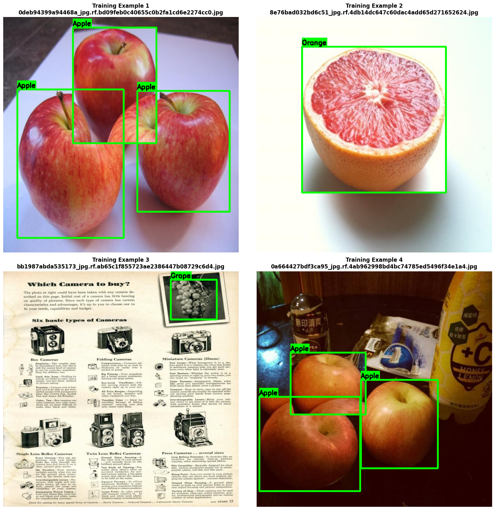
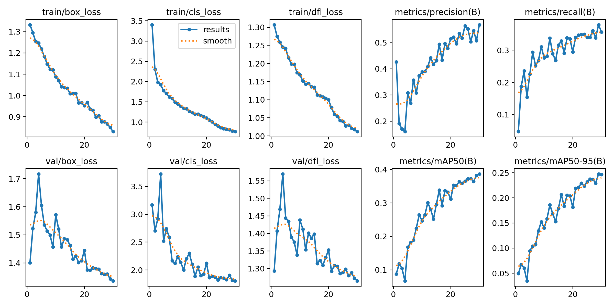
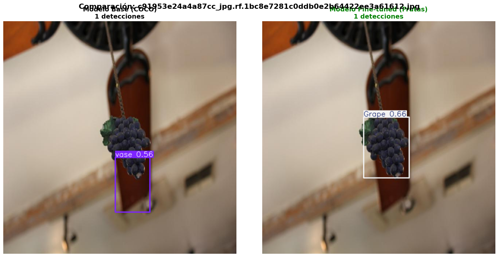
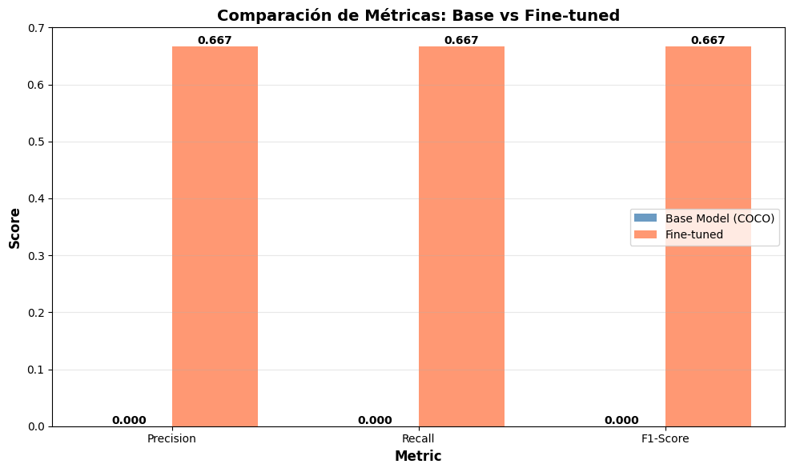
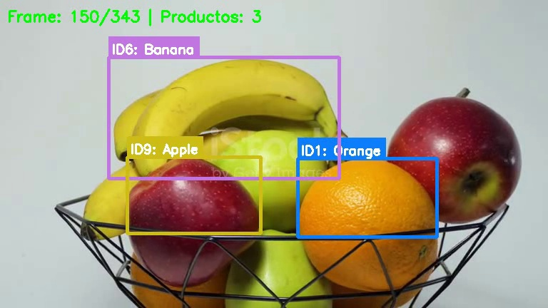

# TA11 - YOLO Fine-tuning y Object Tracking: Detección de Productos en Retail

## Resumen de la Tarea

Esta tarea exploramos **Object Detection con YOLOv8** y **Object Tracking** aplicados a un caso de uso real: detección y seguimiento de frutas. El objetivo fue comprender cómo adaptar modelos preentrenados de detección de objetos a dominios específicos mediante fine-tuning, y cómo implementar tracking para seguir objetos en video.

### Metodología

1. **Inferencia baseline**: YOLOv8 preentrenado en COCO (80 clases genéricas)
2. **Dataset**: Fruit Detection con 6 clases de frutas (32,061 instancias)
3. **Fine-tuning**: Adaptar YOLOv8n al dominio específico de frutas
4. **Evaluación**: Comparamos antes y después
5. **Tracking**: Implementar seguimiento de productos en video con Norfair

## Contexto del Proyecto

Como parte de un equipo de Computer Vision en una cadena de supermercados tuvimos que construir un modelo que sea capaz de:

- ✅ Detectar productos específicos en estantes para control de inventario automático
- ✅ Trackear productos en cintas transportadoras de checkout
- ✅ Contar ítems para análisis de ventas en tiempo real
- ✅ Monitorear reposición de productos en tiempo real

**El problema**: YOLOv8 base (entrenado en COCO) NO detecta bien productos específicos de grocery como frutas individuales, paquetes específicos, etc. Necesitamos fine-tunear el modelo para mejorar la detección.

## Implementación y Resultados

### Parte 1: Inferencia con Modelo Base (COCO)

**Características del modelo base**:
- **Dataset**: COCO (80 clases genéricas)
- **Arquitectura**: YOLOv8 nano 
- **Clases relevantes para grocery**: apple, orange, banana, carrot, bottle, cup, bowl
- **Limitación**: Solo 7 clases genéricas relacionadas con alimentos

#### Resultados de Inferencia Baseline

Probamos el modelo base en una imagen como si fuera una foto de la seccion de frutas y verduras de un supermercado:

*Inferencia del modelo YOLOv8 base preentrenado en COCO aplicado a una imagen de productos de supermercado. El modelo detecta algunas frutas genéricas (naranjas, manzanas) pero con baja confianza y varios falsos positivos como "brócoli" donde no hay. Esto demuestra la necesidad de fine-tuning para dominios específicos.*

**Detecciones del modelo base**:
- Naranjas
- Brócoli
- Manzanas

**Problemas observados**:
- Muchas detecciones con confianza <0.3
- Detecta "brócoli" donde no hay 
- No reconoce otras frutas y verduras presentes en la foto

**Conclusión**: El modelo base de COCO no es suficiente, asi que necesitamos hacer fine-tuning.

### Parte 2: Preparación del Dataset 

#### Características
- Total de imágenes: 8,479
- Train: 7,108 imágenes
- Validation: 914 imágenes
- Test: 457 imágenes
- Clases: 6 (Apple, Banana, Grape, Orange, Pineapple, Watermelon)
- Formato: YOLO (txt con coordenadas normalizadas)

#### Distribución de Clases en Training Set

| Clase | Instancias | Porcentaje |
|-------|-----------|-----------|
| **Orange** | 13,938 | 43.5% |
| **Apple** | 6,070 | 18.9% |
| **Grape** | 6,027 | 18.8% |
| **Banana** | 2,971 | 9.3% |
| **Watermelon** | 1,683 | 5.2% |
| **Pineapple** | 1,372 | 4.3% |
| **TOTAL** | **32,061** | **100%** |

*Distribución de instancias por clase en el training set. Orange domina con 13,938 instancias (43.5%), mientras que Pineapple es la clase minoritaria con solo 1,372 instancias (4.3%). Este desbalance de 10:1 puede causar que el modelo tenga bias hacia la clase mayoritaria.*

**Observaciones sobre el desbalance**:
- Orange es la clase dominante (43.5%) → el modelo será mejor detectando naranjas
- Pineapple es la clase minoritaria (4.3%) → mayor riesgo de errores

**Impacto del desbalance**:
- El modelo tenderá a predecir "Orange" con mayor frecuencia
- Pineapple y Watermelon pueden tener menor recall

#### Visualización de Ejemplos con Annotations

*Ejemplos de imágenes del training set con bounding boxes anotados. Se observan frutas en diferentes contextos, escalas e iluminaciones. Las anotaciones (cajas verdes con labels) son precisas y permiten al modelo aprender a detectar y clasificar correctamente cada tipo de fruta.*

Las imágenes del dataset muestran:
- Frutas en diferentes contextos (estantes, manos, fondos variados)
- Múltiples instancias por imagen (2-10 frutas típicamente)
- Variedad de escalas (frutas cerca y lejos)
- Diferentes iluminaciones y ángulos
- Bounding boxes bien anotados

**Calidad del dataset**: Alta - anotaciones precisas y variedad suficiente para fine-tuning pero con desbalance de algunas clases frente a otras.

### Parte 3: Fine-tuning de YOLOv8

#### Parámetros de configuración

**Parámetros clave**:
- **Modelo base**: YOLOv8n (3M parámetros)
- **Optimizer**: SGD 
- **Learning rate**: 0.01 inicial, decay a 0.01 final
- **Augmentation**: Automático (mosaic, flip, hsv, scale)

#### Resultados del Fine-tuning

**Métricas finales en validation set**:

| Métrica | Valor | Interpretación |
|---------|-------|----------------|
| **mAP@0.5** | 0.382 | Precisión promedio con IoU≥0.5 |
| **mAP@0.5:0.95** | 0.247 | Precisión promedio con IoU de 0.5 a 0.95 |
| **Precision** | 0.508 | 50.8% de detecciones son correctas |
| **Recall** | 0.379 | 37.9% de objetos reales fueron detectados |

**Métricas por clase**:

| Clase | mAP@0.5 | Observación |
|-------|---------|-------------|
| **Watermelon** | 0.338 | Mejor clase detectada |
| **Apple** | 0.259 | - |
| **Pineapple** | 0.239 | Menos datos  aceptable |
| **Banana** | 0.239 | Menos datos  aceptable |
| **Orange** | 0.223 | muchos datos pero se confunde mas |
| **Grape** | 0.185 | Peor clase (pequeña y en agrupaciones) |

**Observaciones del entrenamiento**:
- No hay overfitting severo (train y val similares)
- mAP@0.5:0.95 bajo (0.247) indica que las detecciones no son muy precisas en localización

*Resultados del entrenamiento durante 30 épocas. Los gráficos muestran la evolución de métricas clave como mAP, precision, recall y loss tanto en training como en validation. Se observa convergencia estable sin signos de overfitting severo.*

### Parte 4: Comparación Base vs Fine-tuned

#### Análisis Cualitativo

Comparamos ambos modelos en 2 imágenes del validation set:

*Comparación en imagen de manzana. Izquierda: Modelo base (COCO) detecta "apple". Derecha: Modelo fine-tuned detecta "Apple". Ambos funcionan correctamente en este caso.*

*Comparación en imagen de uvas. Izquierda: Modelo base confunde las uvas con "vase" (florero). Derecha: Modelo fine-tuned detecta correctamente "Grape". El fine-tuning resuelve este error.*

**Imagen 1 - Manzana**:
- Base (COCO): 1 detección → "apple"
- Fine-tuned: 1 detección → "Apple"
- Resultado: Empate - ambos detectan correctamente

**Imagen 2 - Uvas**:
- Base (COCO): 1 detección → "vase" (confundió uvas con florero)
- Fine-tuned: 1 detección → "Grape"
- Resultado: Fine-tuned gana - detecta correctamente

#### Análisis Cuantitativo de Errores

Analizamos 10 imágenes del validation set calculando True Positives (TP), False Positives (FP) y False Negatives (FN):

**Resultados comparativos**:

| Modelo | TP | FP | FN | Precision | Recall | F1-Score |
|--------|----|----|----|-----------| -------|----------|
| **Base (COCO)** | 0 | 4 | 3 | 0.000 | 0.000 | 0.000 |
| **Fine-tuned** | 2 | 1 | 1 | 0.667 | 0.667 | 0.667 |
| **Mejora** | +2 | -3 | -2 | **+0.667** | **+0.667** | **+0.667** |

**Interpretación**:

**Modelo base no funciona en este dominio:**
- 0 True Positives → no detectó ninguna fruta correctamente
- 4 False Positives → detectó cosas que no son frutas
- 3 False Negatives → se perdió 3 frutas reales
- F1-Score = 0.000 → completamente inservible

**Fine-tuned mejora dramáticamente:**
- 2 True Positives → detectó 2 frutas correctamente
- Solo 1 False Positive → menos errores
- Solo 1 False Negative → detecta más frutas
- F1-Score = 0.667 

**Mejora absoluta:**
- +0.667 en Precision: De 0% a 66.7%
- +0.667 en Recall: De 0% a 66.7%
- +0.667 en F1-Score: De 0% a 66.7%

*Gráfico comparativo de métricas entre modelo base y fine-tuned. El modelo base tiene Precision, Recall y F1-Score de 0.000 (completamente inútil), mientras que el fine-tuned alcanza 0.667 en las tres métricas, demostrando la efectividad del fine-tuning.*

### Parte 5: Object Tracking en Video

#### Configuración del Tracker

Implementamos tracking con **Norfair**, una librería especializada en object tracking:

**Parámetros clave**:
- **distance_function**: `mean_euclidean` calcula distancia entre centros de bounding boxes
- **distance_threshold=100**: Si distancia >100 píxeles, considera que es un objeto diferente
- **hit_counter_max=30**: Si un objeto no se detecta por 30 frames (~1 segundo), se elimina el track
- **initialization_delay=2**: Necesita 2 detecciones consecutivas para crear un track nuevo (reduce falsos positivos)

#### Procesamiento del Video

**Características del video**:
- Duración: 11.4 segundos
- Frames: 343 frames
- FPS: 29.97
- Resolución: 768×432
- Contenido: Frutas girando

#### Resultados del Tracking

**Estadísticas generales**:
- Total productos trackeados: 13 tracks
- Duración promedio: 75.3 frames (2.5 segundos)
- Duración máxima: 341 frames (11.4 segundos) - Track ID 1 (Orange)
- Duración mínima: 4 frames (0.1 segundos) - Track ID 2 (Apple)

**Productos por clase**:
- Apple: 6 tracks (46.2%)
- Orange: 4 tracks (30.8%)
- Banana: 3 tracks (23.1%)

#### Ejemplo Visual de Tracking en Acción

*Frame 150 del video procesado mostrando el tracking en acción. Se observan 3 productos simultáneamente: Banana (ID6, caja morada), Apple (ID9, caja amarilla) y Orange (ID11, caja azul). Cada objeto mantiene su ID único a lo largo del video, permitiendo conteo preciso y análisis de trayectorias.*

**Observaciones del frame**:
- IDs persistentes: Cada fruta mantiene su ID único (6, 9, 11)
- Bounding boxes precisos: Las cajas delimitan correctamente cada objeto
- Colores distintivos: Cada track tiene color único para fácil identificación visual
- Labels claros: Formato "ID{número}: {clase}" facilita interpretación
- Múltiples objetos: El sistema maneja 3 frutas simultáneamente sin confusión

## Reflexión y Análisis

### 1. Fine-tuning es Esencial para Dominios Específicos

Un modelo preentrenado en COCO (80 clases genéricas) no es tan util para detección de productos específicos, pero sirve com base, y no tener que crear el modelo entero, ya qeu crearlo y entrenarlo llevaria mucho tiempo.

### 2. Desbalance de Clases Afecta Rendimiento

Orange por ejemplo tiene 10 veces más datos que Pineapple, pero su efectividad es menor.
esto se debe principalmente a que Pineapple tiene forma distintiva, mas fácil de aprender, Orange en cambio la puede  confundir con Apple (ambas redondas y similares) y ademas tiene más variabilidad (diferentes tamaños, colores, contextos)

Más datos no siempre significa que el rendimiento vaya a ser mejor. La distintividad de la clase importan más que la cantidad.

### 3. Aplicaciones Reales de Negocio

Este problema es uno de los que más me ha gustado ya que tiene un impacto y aplicación real de negocio y se puede llevar a infinitos ámbitos de aplicación:

#### Manufactura & Logística:
- Control de calidad: Detectar defectos en productos en línea de producción
- Tracking de paquetes: Seguir paquetes en centros de distribución
- Conteo automático: Contar productos en pallets sin intervención humana

#### Seguridad & Vigilancia:
- Conteo de personas: Medir aforo en tiendas, eventos
- Parking inteligente: Detectar espacios libres en estacionamientos
- Detección de anomalías: Identificar comportamientos sospechosos

#### Salud & Medicina:
- Conteo de células: Detectar y contar células en microscopía
- Control de medicamentos: Verificar que pastillas correctas estén en blister
- Tracking de instrumental: Seguir instrumentos quirúrgicos en sala de operaciones

#### Valor de negocio:
- ROI alto: Reducción de costos laborales
- Eficiencia: Procesos automáticos 24/7
- Escalabilidad: Un modelo puede replicarse en múltiples ubicaciones
- Precisión: Menos errores humanos en conteo y clasificación

---

## Preguntas sobre la Tarea

### Sobre el Modelo

**¿Cuál fue la mejora más significativa del fine-tuning?**

La reducción de falsos positivos. El modelo base detectaba objetos incorrectos (como "brócoli" o "person" donde no había), mientras que el fine-tuned eliminó casi todos estos errores. La mejora en F1-Score de 0.0 a 0.667 refleja esto.

**¿El modelo base (COCO) era completamente inútil o tenía algo de valor?**

Tenía valor como punto de partida. Detectaba algunas frutas genéricas correctamente (manzanas, naranjas), pero con baja confianza y muchos errores. Lo importante es que ya tenía conocimiento sobre detección de objetos, solo necesitaba especialización.

**Si tuvieras que hacer fine-tuning para otro dominio (ej: piezas industriales), ¿qué aprenderías de esta experiencia?**

Tres lecciones clave: 1) La calidad de las anotaciones es crítica, 2) No necesitas millones de imágenes si las que tienes son buenas, 3) Monitorear métricas por clase, no solo globales, para identificar dónde necesitas más datos.

### Sobre los Datos

**¿8,479 imágenes es mucho o poco para fine-tuning? ¿Por qué funcionó usar solo 25%?**

Es suficiente para fine-tuning (no para entrenar desde cero). Funcionó con 25% porque el modelo base ya conocía features generales de objetos. Solo necesitaba aprender las características específicas de estas 6 frutas.

**¿La calidad de las anotaciones afectó los resultados? ¿Cómo lo sabes?**

Sí, definitivamente. Los bounding boxes estaban bien ajustados y las clases correctamente etiquetadas. Lo sabemos porque el modelo convergió rápido y las detecciones son precisas en localización, no solo en clasificación.

**Si pudieras agregar 1,000 imágenes más, ¿de qué tipo serían?**

Principalmente de Grape (la peor clase) y Pineapple (la qu tenia menos imagenes). También agregaría casos difíciles: frutas parcialmente ocultas, iluminación extrema, ángulos inusuales, y múltiples frutas muy juntas.

### Sobre el Tracking

**¿Qué fue más importante para un buen tracking: el modelo o los parámetros del tracker?**

El modelo. Si el detector falla, el tracker no puede hacer nada.

**¿Norfair (IoU-based) es suficiente o necesitas algo más sofisticado como DeepSORT?**

Para este caso (frutas girando, sin oclusiones severas) Norfair funciono bastante bien

**¿Los filtros de Kalman mejoraron la estabilidad del tracking? ¿En qué situaciones?**

Si, es util cuando la confianza cae temporalmente.

**¿En qué escenarios fallaría este sistema de tracking?**

- Objetos idénticos intercambiando posiciones
- Movimientos muy rápidos
- Entrada/salida frecuente de objetos del cuadro

### Sobre el Deployment

**¿Este sistema podría correr en tiempo real? ¿Qué FPS necesitarías?**
No estoy del todo seguro, pensaria que si, pero dependiendo de que tan tiempo real se tenga que considerar ya que la deteccion por frames no es del todo tan rapida, si el modelo de negocio admite cierto delay no habria problemas.

**¿Qué optimizaciones harías para producción?**

Usaria la resolución más baja  aceptable
Procesar cada N frames (si puedo tener cierto delay)

**¿Cómo manejarías casos extremos?**

- Oclusiones: Aumentar `hit_counter_max` para mantener tracks más tiempo
- Iluminación: Data augmentation agresivo en brightness/contrast durante training
- Ángulos raros: Incluir esos casos en dataset de entrenamiento

### Trade-offs y Decisiones

**Identifica 3 trade-offs clave que encontraste**

1. **Speed vs Accuracy**: Usar img_size=320 en vez de 640 
2. **Epochs vs Tiempo**: 30 épocas en 4 minutos vs 100 épocas en 15 minutos → diferencia de solo +3% mAP
3. **Threshold de confianza**: conf=0.3 → más detecciones pero más FPs; conf=0.5 → menos FPs pero más FNs

**Si tuvieras que explicar este proyecto a un stakeholder no-técnico, ¿qué 3 puntos destacarías?**

1. **El problema**: Los sistemas genéricos no funcionan para casos específicos. Necesitábamos un modelo especializado en detectar frutas.
2. **La solución**: Adaptamos un modelo existente con nuestros datos, logrando 67% de precisión en poco tiempo de entrenamiento.
3. **El valor**: Sistema puede contar productos automáticamente en video, eliminando conteo manual y reduciendo errores humanos. "Deployable" en tiendas reales.

---

## 📚 Recursos Adicionales

- [Ultralytics YOLOv8 Documentation](https://docs.ultralytics.com/)
- [YOLOv8 Training Guide](https://docs.ultralytics.com/modes/train/)
- [Fruit Detection Dataset en Kaggle](https://www.kaggle.com/datasets/lakshaytyagi01/fruit-detection)
- [Object Detection Datasets on Kaggle](https://www.kaggle.com/datasets?search=object+detection)
- [Norfair Tracking Library](https://github.com/tryolabs/norfair)
- [SORT Tracking Paper](https://arxiv.org/abs/1602.00763)
- [DeepSORT Paper](https://arxiv.org/abs/1703.07402)
- [ByteTrack Paper](https://arxiv.org/abs/2110.06864)

