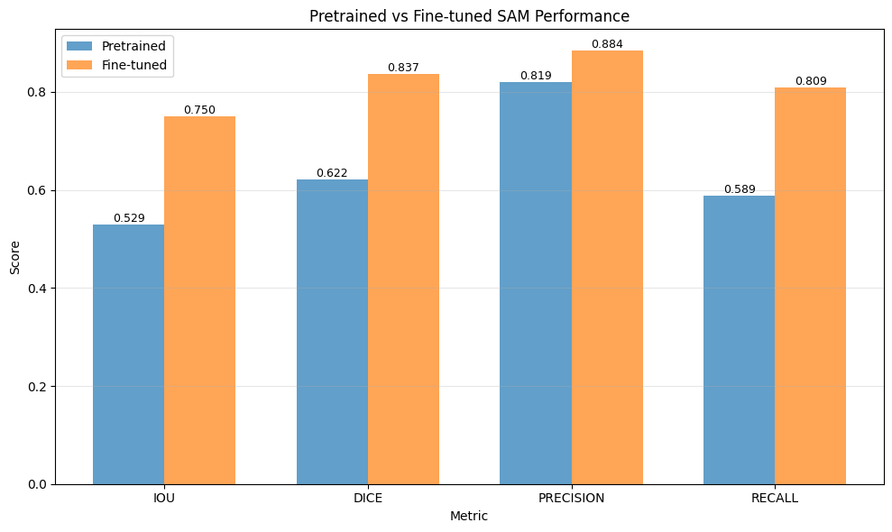
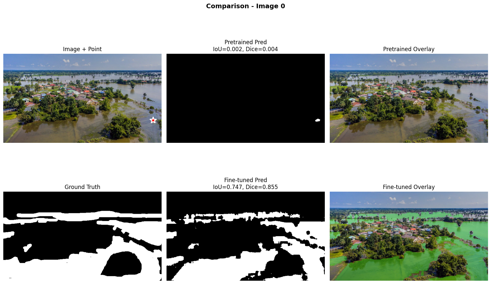
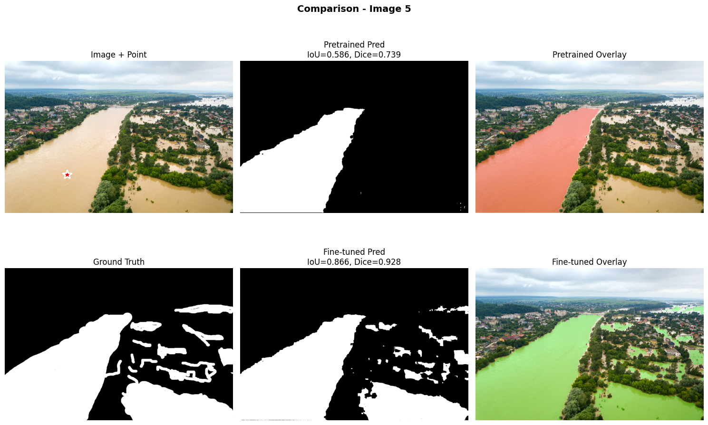

# TA12 - Segment Anything Model (SAM): Segmentación de Áreas Inundadas

## Resumen de la Tarea

Esta tarea exploramos **Segment Anything Model (SAM)** aplicado a un caso de uso crítico: segmentación de áreas inundadas para monitoreo de desastres y respuesta a emergencias. El objetivo fue comprender cómo funcionan los modelos de segmentación con prompts y evaluar la efectividad del fine-tuning en dominios específicos.

### Metodología

1. **Baseline Zero-shot**: SAM preentrenado sin modificaciones
2. **Dataset**: Flood Area Segmentation (290 imágenes de áreas inundadas)
3. **Prompting**: Evaluación con point prompts y box prompts
4. **Fine-tuning**: Adaptar SAM al dominio específico de detección de agua

SAM es un modelo general entrenado en SA-1B (11M imágenes, 1.1B máscaras), pero ¿puede especializarse en detectar agua en contextos de inundación sin perder su capacidad de generalización?

## Implementación y Resultados

### Parte 1: Exploración del Dataset

#### Características del dataset

El dataset consta de 290 imágenes aéreas/satelitales de áreas inundadas, divididas en 80 para entrenamiento y 20 para validación. Las imágenes son RGB acompañadas de máscaras binarias (0=tierra, 1=agua) con tamaños variables que fueron redimensionadas a 1024×1024 para SAM. El dataset está balanceado en términos de píxeles (43% agua vs 57% tierra) con gran variabilidad en tamaños de imagen y contextos diversos incluyendo escenarios urbanos, rurales, ríos e inundaciones costeras. La calidad del dataset es alta con máscaras precisas y boundaries bien definidos, proporcionando una buena variedad de escenarios de inundación.

### Parte 2: SAM Pretrained - Zero-shot Inference

#### Arquitectura de SAM

- **Image Encoder**: ViT-B (Vision Transformer Base) - 93.7M parámetros
- **Prompt Encoder**: Procesa points, boxes o masks como input
- **Mask Decoder**: Genera máscaras de segmentación - 4.1M parámetros

#### Tipos de prompts evaluados

Se evaluaron dos tipos de prompts: **Point Prompts** que consisten en un punto (x, y) con label de foreground/background, ofreciendo mínima interacción humana pero siendo ambiguos en regiones complejas; y **Box Prompts** que utilizan bounding boxes [x1, y1, x2, y2], proporcionando menos ambigüedad y mejor contexto espacial aunque requieren más información previa.

#### Resultados Zero-shot

El modelo pretrained falla en áreas que no se distingue bien el agua, la confunde con superficies oscuras como asfalto o sombras. No captura bien inundaciones irregulares.

### Parte 3: Fine-tuning de SAM

#### Estrategia de Fine-tuning

La estrategia consistió en congelar el Image Encoder (93.7M parámetros) y el Prompt Encoder para mantener las features generales y la capacidad de procesar prompts, mientras que solo se entrenó el Mask Decoder (4.1M parámetros) para especializarse en detectar agua. Este approach es más eficiente ya que entrenar solo el 4.3% de los parámetros evita overfitting y preserva la capacidad de generalización del modelo. Además, se aplicó data augmentation mediante HorizontalFlip, VerticalFlip, Rotate y RandomBrightnessContrast para generar más variabilidad en las imágenes de entrenamiento con diferentes orientaciones y niveles de brillo.

#### Resultados del Fine-tuning

**Evolución durante entrenamiento**:

| Epoch | Train Loss | Train IoU | Val Loss | Val IoU |
|-------|-----------|-----------|----------|---------|
| 1 | 0.4673 | 0.5372 | 0.4267 | **0.6272** |
| 3 | 0.3324 | 0.6407 | 0.3241 | **0.7336** |
| 6 | 0.2858 | 0.6905 | 0.2840 | **0.7389** |
| 10 | 0.2644 | 0.7176 | 0.2692 | **0.7606**|
| 15 | 0.2416 | 0.7272 | 0.2778 | 0.7412 |

✅ Mejor modelo en la Epoch 10 (Val IoU = 0.7606)

### Parte 4: Comparación Pretrained vs Fine-tuned

#### Métricas Cuantitativas

| Métrica | Pretrained | Fine-tuned | Mejora |
|---------|-----------|------------|--------|
| **IoU** | 0.5291 | **0.7497** | **+41.68%** |
| **Dice** | 0.6220 | **0.8375** | **+34.65%** |
| **Precision** | 0.8193 | **0.8839** | **+7.89%** |
| **Recall** | 0.5885 | **0.8087** | **+37.41%** |

*Gráfico de barras comparando las cuatro métricas principales entre modelo pretrained (azul) y fine-tuned (naranja). Se observa mejora consistente en todas las métricas, siendo Recall la que muestra mayor incremento absoluto , seguida de IoU  y Dice.*

#### Análisis Cualitativo - Casos de Ejemplo

**Caso 1**:

*Comparación visual del caso más dramático. Superior: El modelo pretrained no detectó prácticamente nada del agua, mientras que el fine-tuned captura correctamente la mayor parte del área inundada.*

**Caso 2**:

*El fine-tuning mejora significativamente la detección de boundaries irregulares y áreas fragmentadas.*

## Reflexión y Análisis

### 1. SAM es un Foundation Model Poderoso pero Requiere Especialización

SAM preentrenado en SA-1B tiene capacidad de segmentación general muy buena, pero para dominios específicos como flood detection es insuficiente. El fine-tuning con solo 80 imágenes logra una mejora de mas del 40% demostrando la eficiencia del transfer learning, y entrenar únicamente el 4.3% de los parámetros preserva la generalización mientras especializa el modelo. 
Los foundation models son excelentes puntos de partida, pero la especialización es necesaria para aplicaciones críticas.

### 2. Prompts: Box > Point para Segmentación de Áreas Irregulares

En este caso particular los box prompts superan a point prompts ya que las areas inundadas son irregulares y estan en varias partes de la imagen. Un solo punto no captura la extensión completa, pero un box proporciona contexto espacial.

### 3. Recall es Más Crítico que Precision en Disaster Response

Para monitoreo de desastres, los False Negatives (bajo recall) significan áreas inundadas no detectadas y personas en riesgo sin ayuda, mientras que los False Positives (baja precision) solo generan falsas alarmas con recursos mal asignados pero sin poner vidas en peligro. El fine-tuning mejoró el recall en +37%, reduciendo significativamente el riesgo de perder áreas críticas, lo que demuestra que en aplicaciones de seguridad y respuesta a emergencias, optimizar recall es prioritario sobre precision.

### 4. Eficiencia del Fine-tuning: Solo 80 Imágenes

Con solo 80 imágenes de entrenamiento logramos una mejora de mas del 40% sobre el baseline. El modelo ya conoce conceptos fundamentales como edges y boundaries, texturas y colores, y contexto espacial, por lo que solo necesita aprender cómo se ve el agua específicamente en contextos de inundación. Esto demuestra que para nuevos dominios no se necesita millones de imágenes si partimos de un foundation model bien entrenado.

### 5. Combined Loss (BCE + Dice) es Efectivo

La combinación 50/50 de BCE y Dice funcionó bien, donde BCE optimiza la clasificación pixel-wise y Dice optimiza el overlap global, resultando en un balance efectivo entre precisión local y coherencia global de la máscara.

### 6. Aplicaciones Más Allá de Flood Detection

Este tipo de modelado es extremadamente util para detectar y segmentar áreas de interés:

#### Respuesta ante incidentes

En el ámbito de gestión de desastres, SAM puede aplicarse no solo a la detección de inundaciones (nuestro caso de uso actual), sino también a la segmentación de áreas quemadas en imágenes satelitales para monitoreo de incendios, identificación de zonas de deslizamiento de tierra, y mapeo de edificios colapsados tras terremotos, permitiendo una respuesta más rápida y coordinada en situaciones de emergencia.

#### Monitoreo ambiental

Para monitoreo ambiental, este tipo de segmentación es util para detectar áreas de tala ilegal en bosques, analizar patrones en corrientes oceánicas mediante las texturas y colores del agua, segmentar floraciones de algas tóxicas que afectan ecosistemas marinos, y trackear el retroceso de glaciares como indicador del cambio climático, proporcionando datos críticos para la conservación y estudios ambientales.

#### Planificación urbana

Para planificación urbana, la tecnología permite mapear áreas susceptibles a inundación para prevención de desastres, detectar islas de calor urbanas donde la temperatura es elevada para mejorar diseño de espacios públicos, y cuantificar áreas verdes en ciudades para evaluar calidad de vida y planificar desarrollo sostenible.

---

## Preguntas sobre la Tarea

### ¿Por qué el pretrained SAM puede fallar en detectar agua en imágenes de inundaciones efectivamente?

SAM fue entrenado en SA-1B, un dataset general con objetos bien definidos y boundaries claros. El agua en inundaciones presenta desafíos específicos que no están bien representados en ese dataset:

- El agua no tiene forma definida, se adapta al terreno
- Confunde al modelo con superficies metálicas o vidrio
- Agua marrón/turbia se parece a tierra o barro

### ¿Qué componentes de SAM decidiste fine-tunear y por qué? ¿Por qué congelamos el image encoder?

Solo el Mask Decoder (4.1M parámetros, 4.3% del total)
Image Encoder (ViT-B, 93.7M params) y Prompt Encoder
Si tuviéramos muchas mas imágenes, podríamos considerar fine-tunear el encoder también.

### ¿Cómo se comparan point prompts vs box prompts en este caso de uso de flood segmentation?

Box prompts son superiores para este dominio. El contexto espacial del box ayuda a SAM a entender la extensión del área inundada.

### ¿Qué mejoras específicas observaste después del fine-tuning?

- Ahora captura bordes complejos del agua correctamente
- Detecta agua marrón/turbia que antes confundía con tierra

### ¿Este sistema está listo para deployment en un sistema de respuesta a desastres? ¿Qué falta?

No esta lista para escenarios de respuesta critica, pero puede servir como prueba piloto o MVP en escenarios controlados

Principalmente faltan datos de entrenamiento de distintos escenarios y de diferentes lugares, no es lo mismo uruguay con paisajes de pradera, que el desierto de atacama en chile o la amazonia brasilera.
Tambien faltarian fotos de casos bordes como fotos en la noche, con niebla o lluvia.

Ademas, agregaria testing con organizaciones que tengan experiencia en la respuesta a desastres, que puedan aydar a validar todo el contexto que esta alrededor del caso de uso, como POC esta bien.

### ¿Cómo cambiaría tu approach si tuvieras 10x más datos? ¿Y si tuvieras 10x menos?

Haria fine-tuning de más componentes, y si tuviera menos, buscaria la forma de generar mas datos usando data augmentation, quizas reduciria mas el scope tambien, dependiendo de las imagenes que tenga, deberian ser al menos d algun tipo especifico de inundacion

### ¿Qué desafíos específicos presenta la segmentación de agua en inundaciones?

Desafíos de todo tipo, desde que el agua se esparce de forma irregular, a que en algunos lugares puede ser más transparente y en otras más lodosas, dependiendo del contexto. Son casos muy complicados de llevar a la práctica porque necesitaríamos muchísimos datos para poder cubrir la mayor cantidad posible de escenarios.

---

## 📚 Recursos Adicionales

### Papers y Documentación

- [Segment Anything (SAM) Paper](https://arxiv.org/abs/2304.02643)
- [SAM Official Repository](https://github.com/facebookresearch/segment-anything)
- [SAM Documentation](https://segment-anything.com/)
- [Flood Area Segmentation Dataset](https://www.kaggle.com/datasets/faizalkarim/flood-area-segmentation)
- [Fine-tuning SAM Tutorial](https://encord.com/blog/learn-how-to-fine-tune-the-segment-anything-model-sam/)
- [SAM for Medical Imaging](https://arxiv.org/abs/2304.12306)
- [Prompt Engineering for SAM](https://arxiv.org/abs/2306.17400)

### 🤖 Otros Modelos de Segmentación

Modelos alternativos/complementarios para explorar:

**SAM Variants:**
- [MobileSAM](https://github.com/ChaoningZhang/MobileSAM) - SAM optimizado para dispositivos móviles
- [FastSAM](https://github.com/CASIA-IVA-Lab/FastSAM) - 50x más rápido que SAM original
- [SAM-HQ](https://github.com/SysCV/sam-hq) - Mayor calidad en detección de bordes
- [EfficientSAM](https://github.com/yformer/EfficientSAM) - Optimizado para eficiencia computacional

**Semantic Segmentation:**
- [SegFormer](https://github.com/NVlabs/SegFormer) - Transformer-based segmentation
- [DeepLabV3+](https://github.com/tensorflow/models/tree/master/research/deeplab) - ResNet-based con ASPP
- [U-Net](https://github.com/milesial/Pytorch-UNet) - Arquitectura clásica para segmentación médica
- [Mask2Former](https://github.com/facebookresearch/Mask2Former) - Universal segmentation framework

**Instance Segmentation:**
- [Mask R-CNN](https://github.com/matterport/Mask_RCNN) - Clásico robusto y confiable
- [YOLACT](https://github.com/dbolya/yolact) - Real-time instance segmentation
- [SOLOv2](https://github.com/WXinlong/SOLO) - Simple y efectivo

**Panoptic Segmentation:**
- [Panoptic-DeepLab](https://github.com/bowenc0221/panoptic-deeplab) - Semantic + instance unificado
- [EfficientPS](https://github.com/DeepSceneSeg/EfficientPS) - Estado del arte en panoptic segmentation

### 📊 Datasets Públicos Recomendados

**Medical Imaging:**

- [Medical Segmentation Decathlon](http://medicaldecathlon.com/) - 10 tareas médicas diferentes
- [ISIC Skin Lesion](https://www.isic-archive.com/) - Detección de melanoma y lesiones cutáneas
- [Chest X-Ray Segmentation](https://www.kaggle.com/datasets/nikhilpandey360/chest-xray-masks-and-labels) - Segmentación de pulmones en rayos X

**Satellite & Aerial:**

- [SpaceNet](https://spacenet.ai/) - Building footprints, roads y infraestructura
- [DOTA](https://captain-whu.github.io/DOTA/) - Object detection en imágenes aéreas
- [Aerial Semantic Segmentation](https://www.kaggle.com/datasets/humansintheloop/semantic-segmentation-of-aerial-imagery) - Segmentación de imágenes aéreas

**Industrial & Manufacturing:**

- [MVTec AD](https://www.mvtec.com/company/research/datasets/mvtec-ad) - Defect detection en manufactura
- [Steel Defect Detection](https://www.kaggle.com/c/severstal-steel-defect-detection) - Detección de defectos en acero
- [PCB Defect Dataset](https://www.kaggle.com/datasets/akhatova/pcb-defects) - Defectos en placas de circuito impreso

**Natural Images:**

- [COCO-Stuff](https://github.com/nightrome/cocostuff) - 164K imágenes con scene segmentation
- [ADE20K](https://groups.csail.mit.edu/vision/datasets/ADE20K/) - Scene parsing con 150 clases
- [Cityscapes](https://www.cityscapes-dataset.com/) - Segmentación urbana para conducción autónoma

**Domain-Specific:**

- [Plant Disease Detection](https://www.kaggle.com/datasets/vipoooool/new-plant-diseases-dataset) - Enfermedades en plantas
- [Underwater Trash](https://www.kaggle.com/datasets/ashewale/underwater-trash-detection) - Detección de basura submarina
- [Food Segmentation](https://www.kaggle.com/datasets/kmader/food41) - Segmentación de alimentos

