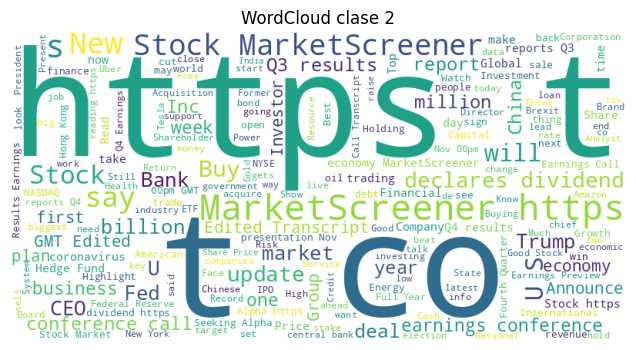

# TA13 - Sentimen Analysis: Análisis se Sentimientos en tweets financieros usando Transformers

## Resumen de la Tarea

En esta tarea abordamos el análisis de sentimiento en noticias financieras utilizando **Transformers**, específicamente haciendo fine-tuning de un modelo **BERT** pre-entrenado en el dominio financiero (FinBERT). El objetivo principal es comparar el rendimiento de técnicas clásicas de NLP (Bag of Words + Regresión Logística) frente a modelos de lenguaje modernos basados en atención.

### Metodología

La metodología aplicada comenzó con una exploración de los datos (EDA) utilizando análisis de n-grams y técnicas de reducción de dimensionalidad como PCA y UMAP para comprender la distribución de las clases. Posteriormente, se estableció una línea base mediante un modelo clásico de TF-IDF con Regresión Logística, para luego proceder al fine-tuning del modelo `ProsusAI/finbert` especializado en finanzas. Finalmente, se evaluó el desempeño de ambos enfoques comparando métricas clave como Accuracy y F1-score, junto con un análisis detallado de las matrices de confusión.

El dataset utilizado es `zeroshot/twitter-financial-news-sentiment`, que contiene tweets financieros etiquetados.

## Implementación y Resultados

### Parte 1: Exploración del Dataset y Preprocesamiento

El dataset contiene textos financieros etiquetados en tres clases:

- 0: Bearish (Bajista)
- 1: Bullish (Alcista)
- 2: Neutral

#### Análisis de N-grams y Ruido

Al analizar los n-grams más frecuentes, encontramos una presencia significativa de ruido. Términos como "co", "https" y "https co" dominan en todas las clases, lo que indica que las URLs y los tickers abreviados son muy comunes y podrían no aportar valor semántico directo para el sentimiento sin limpieza previa.

#### Embeddings Estáticos (Word2Vec)

Entrenamos un modelo Word2Vec rápido para ver relaciones semánticas. Los resultados muestran coherencia con el dominio financiero:

- Vecinos de "price": *cut, stock, raised, at, from, target*.
- Vecinos de "market": *back, set, stocks*.

Esto sugiere que incluso embeddings simples capturan bien el contexto financiero.

### Parte 2: Baseline (TF-IDF + Logistic Regression)

Como punto de partida, utilizamos un vectorizador TF-IDF (max features=30000) y una Regresión Logística.

**Resultados del Baseline:**

- Accuracy: ~80%
- F1-score: ~0.68

La matriz de confusión revela que el baseline tiene un sesgo fuerte hacia la clase mayoritaria (Neutral), con un recall muy alto (0.97) para esta clase, pero falla significativamente en las clases más importantes para la toma de decisiones: Bearish (recall 0.39) y Bullish (recall 0.54).

### Parte 3: Fine-tuning con FinBERT

Para el proceso de fine-tuning, seleccionamos el modelo `ProsusAI/finbert`, el cual ofrece una ventaja significativa al estar pre-entrenado específicamente en un corpus financiero masivo. La configuración del entrenamiento consistió en 4 épocas con un learning rate de 5e-5 y un batch size de 8, utilizando el optimizador AdamW por defecto. Durante el entrenamiento, el modelo exhibió una mejora constante y una convergencia rápida, validando la eficacia del transfer learning desde un modelo de dominio específico.

### Parte 4: Comparación Baseline vs Transformer

| Métrica | Baseline (TF-IDF + LR) | Transformer (FinBERT) | Mejora |
|:-------:|:----------------------:|:---------------------:|:------:|
| **Accuracy** | 0.796 | 0.877 | +8.1% |
| **F1-Score** | 0.683 | 0.839 | +15.6% |

El modelo Transformer supera ampliamente al baseline, especialmente en el F1-Score, lo que indica un mejor balance entre precision y recall y, crucialmente, un mejor desempeño en las clases minoritarias (Bearish/Bullish) que son las más difíciles para el baseline.

## Reflexión y Análisis

### 1. La Importancia del Pre-entrenamiento de Dominio

El uso de `FinBERT` en lugar de un `BERT` genérico es clave. El modelo ya "sabe" qué palabras son relevantes en finanzas (e.g., "cut" en ganancias es malo, "cut" en costos puede ser bueno). Esto permite alcanzar altos rendimientos con pocos datos y pocas épocas de fine-tuning.

### 2. Limitaciones del Bag of Words

El baseline falla porque pierde el contexto secuencial y la negación. En finanzas, el orden importa ("target price raised to..." vs "raised target price..."). TF-IDF solo cuenta frecuencias, mientras que BERT entiende la estructura completa de la oración.

### 3. Desbalance de Clases

El dataset está desbalanceado hacia la clase Neutral. El baseline cae en la trampa de predecir casi siempre Neutral para maximizar accuracy, ignorando las señales de mercado. El Transformer, logra distinguir mejor las señales de las clases Bullish y Bearish.

## Preguntas de reflexion

### ¿Qué n‑grams son más frecuentes por clase? ¿Te sorprenden?

Los n-grams más frecuentes fueron consistentemente "co", "https", y combinaciones de estos en todas las clases. No es sorprendente dado que son tweets que suelen contener enlaces acortados (t.co). Sin embargo, esto resalta la necesidad de una limpieza de datos para eliminar URLs y stop words específicas de la plataforma para no "gastar" capacidad del modelo en tokens irrelevantes.

### ¿Qué sesgos/ruido ves en las nubes de palabras?

Las nubes de palabras (aunque visuales) confirmarían el predominio de términos de enlace que pueden aparecer en cualquier sentimiento. El ruido principal son las URLs y menciones de usuarios o tickers que no llevan carga de sentimiento.

### ¿Hay separabilidad en PCA/UMAP? Si no, ¿por qué?

Se observa cierta agrupación, especialmente de la clase Neutral, pero hay un solapamiento considerable entre Bullish y Bearish en la proyección 2D de TF-IDF. Esto se debe a que comparten mucho vocabulario (e.g., "price", "target", "earnings") y la diferencia radica en el contexto o adjetivos específicos que TF-IDF no separa tan claramente como los embeddings contextuales.

### ¿Los vecinos de Word2Vec reflejan semántica financiera?

Sí, claramente. Palabras como "price" tienen vecinos como "cut", "raised", "target", lo cual tiene total sentido financiero (cambios de precio objetivo). Esto valida que incluso modelos simples capturan la semántica del dominio.

### ¿En qué clases falla más el baseline? ¿Por qué?

Falla más en **Bearish (Clase 0)** y **Bullish (Clase 1)**. El baseline optimiza accuracy global y, al ser la clase Neutral la más abundante, tiende a predecir Neutral.

### ¿Cuánto mejora el Transformer al baseline? ¿Dónde empeora?

Mejora el F1-Score en más de 15 puntow. No "empeora" en métricas globales, pero el costo computacional (tiempo de entrenamiento y necesidad de GPU) es órdenes de magnitud mayor que el baseline, que se entrena en segundos en CPU.

### ¿Qué costo de entrenamiento observaste?

El entrenamiento del Transformer requirió uso de GPU y tomó varios minutos.

### ¿Cuál método elegirías para producción y por qué?

Para un sistema de análisis de sentimiento financiero donde la precisión es dinero, elegiría **FinBERT (Transformer)** sin duda. La mejora en la detección de señales de compra/venta justifica el costo extra. El baseline pierde en demasiadas oportunidades.

### ¿Qué siguientes pasos intentarías?

Como pasos futuros para mejorar el sistema, se podría implementar una limpieza de datos más exhaustiva, eliminando URLs y normalizando tickers para reducir el ruido. Tambien, se podría explorar el uso de técnicas de Ensemble combinando predicciones de múltiples modelos, como RoBERTa y FinBERT, para robustecer los resultados.

## Conclusión

Esta práctica demuestra la superioridad de los modelos de lenguaje pre-entrenados en dominio específico (FinBERT) sobre enfoques tradicionales (TF-IDF) para tareas complejas como el análisis de sentimiento financiero. A pesar del mayor costo computacional, la capacidad del Transformer para capturar el contexto y matices del lenguaje financiero justifica su uso, especialmente en aplicaciones críticas donde la precisión en la detección de señales de mercado es fundamental.
