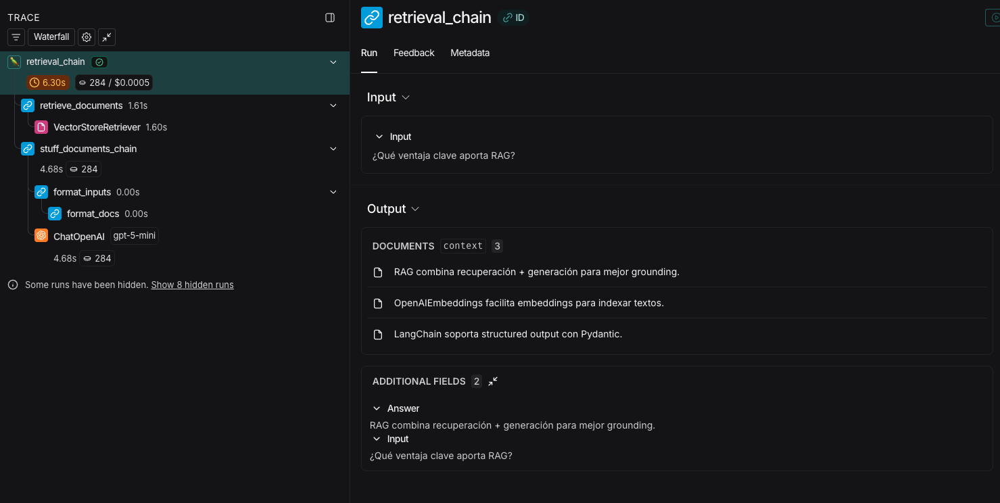

# TA14 - LLMs con LangChain: Prompting, Plantillas y Salida Estructurada

## Resumen de la Tarea

En esta tarea exploramos el uso de **Large Language Models (LLMs)** a través de **LangChain**, un framework diseñado para simplificar la construcción de aplicaciones con modelos de lenguaje. El objetivo principal fue dominar técnicas fundamentales de prompting, control de parámetros, y salidas estructuradas confiables.

### Metodología

La metodología consistió en una progresión incremental desde conceptos fundamentales hasta aplicaciones avanzadas. Comenzamos con la configuración básica de `ChatOpenAI` y pruebas de invocación simple, para luego experimentar con parámetros de decodificación (`temperature`, `top_p`, `max_tokens`) y analizar su impacto en la generación. A continuación, exploramos el diseño de prompts reutilizables mediante `ChatPromptTemplate` y la composición de componentes con LCEL (LangChain Expression Language), lo que permitió construir pipelines declarativos y mantenibles. El siguiente paso fue implementar schemas con Pydantic para garantizar salidas estructuradas confiables, eliminando la necesidad de parseo manual. Finalmente, aplicamos estos conceptos en casos de uso avanzados como few-shot learning para clasificación, patrones Map-Reduce para resumir documentos extensos, extracción de entidades nombradas, y la implementación de un sistema RAG (Retrieval-Augmented Generation) básico con FAISS. Durante toda la práctica utilizamos `gpt-5-mini` de OpenAI, balanceando costo y capacidad para experimentación.

## Implementación y Resultados

### Parte 1: Configuración Básica y Primeras Invocaciones

La configuración inicial requirió la instalación de dependencias clave (`langchain`, `langchain-openai`, `langsmith`) y la configuración de API keys. El primer contacto con el modelo demostró la simplicidad de LangChain:

El modelo respondió con precisión técnica, capturando los conceptos clave (atención, paralelización, codificación posicional) en una sola frase coherente.

### Parte 2: Experimentación con Temperature

La experimentación con diferentes valores de `temperature` (0.0, 0.5, 0.9) reveló patrones claros en el comportamiento del modelo:

| Temperature | Características |
|-------------|-----------------|
| 0.0 | Determinista, consistente, repetible |
| 0.5 | Balance entre creatividad y coherencia |
| 0.9 | Alta variabilidad, creatividad máxima |

Con `temperature=0.0`, el modelo generó respuestas casi idénticas en múltiples ejecuciones. Con valores más altos, las respuestas mantuvieron la corrección pero variaron en estilo y estructura.

### Parte 3: Salida Estructurada con Pydantic

Una de las capacidades más poderosas de LangChain es la garantía de salidas estructuradas mediante schemas de Pydantic. Definiendo clases que heredan de `BaseModel` con campos tipados (como `title: str` y `bullets: List[str]`), podemos utilizar el método `with_structured_output()` para forzar al modelo a devolver JSON que cumpla exactamente con el schema especificado. El resultado es un objeto Pydantic válido con validación de tipos garantizada, eliminando completamente la necesidad de parseo manual, manejo de errores de formato, y validación de campos.

Por ejemplo, al solicitar un resumen de riesgos de prompt injection, el modelo devuelve:

```json
{
  "title": "Riesgos de 'prompt injection' en LLM apps",
  "bullets": [
    "Exfiltración de datos sensibles: un atacante puede inducir al modelo a revelar secretos o información confidencial presente en el contexto o prompts previos.",
    "Manipulación del comportamiento y seguridad: instrucciones maliciosas pueden anular salvaguardas y provocar respuestas inseguras, desinformación o acciones no deseadas.",
    "Compromiso de integridad y confianza del sistema: permite eludir controles, ejecutar acciones no autorizadas o afectar componentes downstream (APIs, código), minando la fiabilidad y seguridad de la aplicación."
  ]
}
```

Esta característica es crítica para aplicaciones de producción donde la confiabilidad y el contrato de datos son fundamentales, transformando salidas potencialmente impredecibles en estructuras de datos consistentes y verificables.

### Parte 4: Few-Shot Learning

La comparación entre zero-shot y few-shot prompting mostró diferencias sutiles pero importantes:

- **Zero-shot**: Respuestas correctas pero formatos inconsistentes (a veces solo "POS", otras veces "Etiqueta: POS").

- **Few-shot**: Mayor consistencia en formato, pero también mayor verbosidad. En un caso específico, el modelo agregó justificación no solicitada, evidenciando que los ejemplos pueden "sobre-enseñar" el nivel de detalle.

### Parte 5: Map-Reduce para Resúmenes Largos

Para textos que exceden el contexto óptimo, implementamos un patrón Map-Reduce:

1. **Split**: División del texto largo en chunks con `RecursiveCharacterTextSplitter` (chunk_size=700, overlap=100)
2. **Map**: Resumen independiente de cada chunk en 2-3 bullets
3. **Reduce**: Consolidación de bullets en un resumen coherente final

El resultado fue un resumen conciso de un texto extenso sobre la historia del ajedrez, capturando los puntos clave sin pérdida de información crítica.

### Parte 6: Extracción de Entidades

La extracción de entidades nombradas (NER) se simplifica dramáticamente con structured output. Definiendo un schema anidado con clases `Entidad` (que contiene tipo y valor) y `ExtractInfo` (que agrupa título, fecha y una lista de entidades), el modelo puede analizar texto libre y extraer información estructurada de forma confiable.

**Ejemplo**: Dado el texto *"OpenAI anunció una colaboración con la Universidad Catolica del Uruguay en Montevideo el 05/11/2025"*, el extractor devuelve:

```text
ExtractInfo(
  titulo='OpenAI anunció una colaboración con la Universidad Catolica del Uruguay en Montevideo',
  fecha='05/11/2025',
  entidades=[
    Entidad(tipo='ORG', valor='OpenAI'),
    Entidad(tipo='ORG', valor='Universidad Catolica del Uruguay'),
    Entidad(tipo='LOC', valor='Montevideo')
  ]
)
```

El modelo identificó correctamente dos organizaciones y una ubicación, demostrando capacidad de comprensión semántica y categorización sin necesidad de fine-tuning específico para la tarea de NER.

### Parte 7: RAG Básico con FAISS

La implementación de Retrieval-Augmented Generation combinó varios conceptos:

- **Embeddings**: `OpenAIEmbeddings` para representación vectorial de documentos
- **Vector Store**: FAISS para indexación y búsqueda por similitud
- **Retrieval Chain**: Combinación de recuperación + generación con grounding

El sistema RAG respondió correctamente "RAG combina recuperación + generación para mejor grounding" al buscar en la base de conocimiento, demostrando que el contexto relevante fue recuperado y utilizado efectivamente.

## Conclusiones

LangChain reduce significativamente el boilerplate necesario para trabajar con LLMs, encapsulando tareas complejas en abstracciones claras como `ChatPromptTemplate`, `with_structured_output` y cadenas LCEL. El parámetro `temperature` es el más crítico para controlar el comportamiento, valores bajos o cercanos a 0 son mejores para tareas que requieren respuestas mas deterministas, mientras que valores mas altos son apropiados para generación creativa. La salida estructurada con Pydantic esta buena para parsear a JSON directamente, aunque puede fallar.

Para documentos largos, Map-Reduce esta muy bueno, RAG es el patrón arquitectónico más importante para aplicaciones LLM ya que nos permiten usar nuestro propio conocimiento y contexto con LLMs que ya funcionan bien, reduce alucinaciones, y no requiere un re-entrenamiento.

## Observabilidad con LangSmith



*Visualización del trace completo del `retrieval_chain` en LangSmith, mostrando cada componente del pipeline RAG con sus tiempos de ejecución y costos asociados.*

Durante toda la práctica utilizamos **LangSmith** para tracing y observabilidad de las cadenas LangChain. Esta herramienta es fundamental para entender qué está pasando con nuestras aplicaciones LLM, especialmente en cadenas complejas como RAG.

En el trace del retrieval_chain podemos observar la ejecución completa del pipeline RAG:

1. **retrieve_documents**: El retriever busca en FAISS los documentos más relevantes usando embeddings semánticos
2. **VectorStoreRetriever**: Ejecuta la búsqueda por similitud y devuelve los top-k documentos
3. **stuff_documents_chain**: Toma los documentos recuperados y los agrega al contexto del prompt
4. **ChatOpenAI**: El LLM genera la respuesta final basándose en el contexto recuperado

El trace muestra que el sistema RAG respondió correctamente "*RAG combina recuperación + generación para mejor grounding*" a la pregunta "¿Qué ventaja clave aporta RAG?". Los documentos recuperados fueron relevantes (menciones de RAG, OpenAIEmbeddings, y structured output con Pydantic), demostrando que el retrieval funcionó efectivamente.

**Métricas clave observadas:**

- Tiempo total: 6.30s
- Costo: $0.0005 por query
- Tokens: 284 tokens totales en la generación

LangSmith permite identificar puntos de falla, costos, tiempo, por ejemplo el prompt al chatGPT es lo que demora mas, depurar fallos en el retrieval, y optimizar costos monitoreando el uso de tokens en cada paso de la cadena.

## Preguntas de Reflexión

### ¿Qué cambia si pedís 1 vs 3 oraciones?

Con 3 oraciones, agrega contexto, ejemplos o matices. La diferencia es significativa en densidad de información vs claridad pedagógica.

### ¿Observás variancia entre ejecuciones con la misma consigna?

Con temperatura baja, prácticamente no varia. Con temperatura mas varia incluso en estructura de respuesta.

### ¿Qué combinación te da claridad vs creatividad?

- Claridad: `temperature=0.0` + instrucciones específicas ("en 2 bullets", "solo hechos")  
- Creatividad: `temperature=0.9` + prompts abiertos ("explora posibilidades", "genera alternativas")

### ¿Cuándo conviene few-shot vs instrucciones claras?

Few-shot conviene principalmente cuando el formato de salida es no estándar, el dominio es técnico y requiere desambiguación, o las instrucciones zero-shot fallan consistentemente. Sin embargo, instrucciones claras son generalmente preferibles por ser más eficientes en tokens y más fáciles de mantener.

### ¿Cómo cambia el formato cuando el template fija estructura?

Los templates con roles claros (`system`, `human`, `assistant`) mejoran consistencia. El modelo "entiende" su rol y las expectativas, reduciendo respuestas fuera de contexto.

### ¿Qué mejora frente a "parsear a mano" cadenas JSON?

Elimina errores de parseo (JSON malformado), validación de tipos manual, manejo de campos opcionales o faltantes, y la necesidad de documentar contratos explícitamente ya que el schema sirve como documentación.

### ¿Qué contratos de salida necesitás en producción?

Toda salida que alimente sistemas downstream debe tener schema Pydantic explícito con tipos estrictos, validadores de rango y formato, campos obligatorios vs opcionales claramente definidos, y docstrings para cada campo.

### ¿Qué prompt te costó más tokens?

El Map-Reduce sobre texto largo, donde cada chunk se procesa independientemente y luego se consolida. Sin embargo, es inevitable para textos largos si se quiere mantener calidad.

### ¿Cómo balancear latencia vs calidad?

Las opciones principales en orden de impacto son: usar un modelo más rápidos dependiendo de la tarea que quieramos hacer, por ejemplo si queremos extraer la idea principal de un texto podemos usar GPT3.5 nano tranquilamente, mientras que para tareas mas complejas vamos a necesitar algun modelo mas poderoso.

### ¿Cuándo "alucina" el modelo al no tener suficiente contexto?

Cuando se le pide información específica no presente en el prompt. En el ejemplo Q&A, el modelo correctamente respondió "No suficiente contexto" cuando el contexto era vago. RAG mitiga esto trayendo documentos relevantes.

### ¿Cómo afectan chunk_size y chunk_overlap la calidad?

Un chunk_size muy pequeño pierde contexto y genera resúmenes fragmentados, mientras que uno muy grande resulta costoso y queda con información menos relevante. Un chunk_overlap muy bajo tiene riesgo de cortar oraciones o ideas, mientras que uno muy alto genera redundancia innecesaria y mayor costo.

---

## 📚 Referencias

### Documentación LangChain

- [Integración OpenAI en LangChain (langchain-openai)](https://python.langchain.com/docs/integrations/platforms/openai) — instalación y uso de ChatOpenAI
- [ChatPromptTemplate (Python API docs)](https://api.python.langchain.com/en/latest/prompts/langchain_core.prompts.chat.ChatPromptTemplate.html) — plantillas de chat como runnables
- [LCEL / Runnables](https://python.langchain.com/docs/concepts/lcel/) — composición con `|`, invoke/batch/stream
- [Structured Output](https://python.langchain.com/docs/how_to/structured_output/) — JSON/Pydantic válido con `with_structured_output`
- [LangSmith (tracing/observability)](https://docs.smith.langchain.com/) — guías y quickstart
- [Text Splitters](https://python.langchain.com/docs/how_to/recursive_text_splitter/) — dividir documentos para pipelines de resumen
- [Retrieval (RAG)](https://python.langchain.com/docs/tutorials/rag/) — cadenas de combinación y recuperación
- [FAISS VectorStore](https://python.langchain.com/docs/integrations/vectorstores/faiss/) — índice local para RAG
- [LangSmith Evaluation](https://docs.smith.langchain.com/evaluation) — datasets y evaluación

### Recursos OpenAI

- [OpenAI Text Generation](https://platform.openai.com/docs/guides/text-generation) — guía de parámetros (temperature, top_p, max_tokens)

### Papers y Recursos Adicionales

- [Prompt Engineering Guide](https://www.promptingguide.ai/) — técnicas avanzadas de prompting
- [LangChain Expression Language](https://python.langchain.com/docs/concepts/lcel/) — patrones de composición
- [RAG Survey Paper](https://arxiv.org/abs/2312.10997) — estado del arte en Retrieval-Augmented Generation
