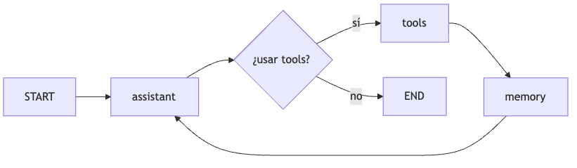
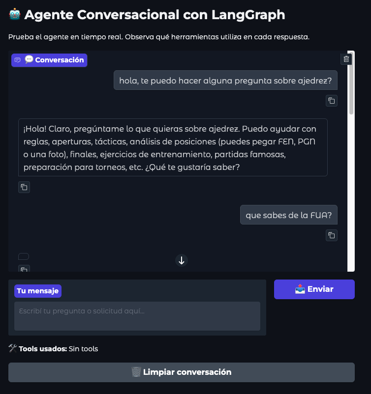
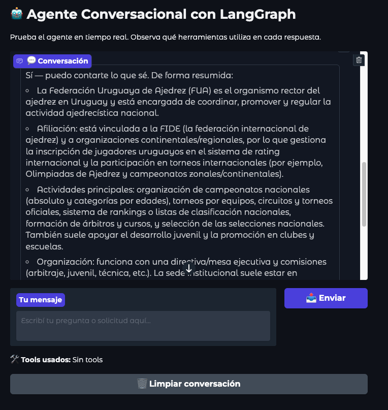

# TA15 - Agentes con LangGraph: RAG, Tools y Memoria Conversacional

## Resumen de la Tarea

En esta tarea exploramos la construcción de **agentes conversacionales autónomos** utilizando **LangGraph**, un framework que permite orquestar modelos de lenguaje (LLMs) con herramientas externas y gestión de estado. El objetivo principal fue diseñar un agente capaz de mantener conversaciones multi-turn, utilizar herramientas especializadas (RAG para búsqueda de conocimiento y otras tools auxiliares), y gestionar memoria conversacional mediante resúmenes incrementales.

### Metodología

La metodología consistió en una construcción incremental hasta un sistema completo con interfaz de usuario. Comenzamos definiendo un `AgentState` tipado con TypedDict que viaja por todo el grafo, conteniendo mensajes y un resumen opcional. Luego implementamos un grafo básico con LangGraph que conecta un nodo `assistant` (que invoca el LLM) con transiciones simples desde START hasta END.

El siguiente paso fue integrar **RAG como tool reutilizable**, creando un vector store FAISS con embeddings de OpenAI sobre un conocimiento específico (Federación Uruguaya de Ajedrez). Implementamos múltiples tools incluyendo `rag_search` para búsqueda semántica, `get_order_status` para consultas de pedidos ficticios, y `get_utc_time` para obtener la hora actual.

La orquestación se logró mediante un grafo con flujo condicional, permitiendo que el agente decida autónomamente cuándo usar herramientas basándose en el contexto. Agregamos un nodo `memory` que genera resúmenes incrementales de la conversación, actualizándose después de cada uso de tools para mantener contexto sin acumular todo el historial. Finalmente, armamos el bot completo en una interfaz **Gradio** con chat interactivo, visualización de tools utilizados, y gestión de estado persistente entre turnos.

Durante toda la práctica utilizamos `gpt-5-mini` y `gpt-5-nano` de OpenAI, con LangSmith habilitado para tracing y observabilidad de las ejecuciones del grafo.

## Implementación y Resultados

### Parte 1: Estado del Agente (AgentState)

Definimos un `AgentState` tipado que viaja por todos los nodos del grafo, compuesto principalmente por una lista de `messages` (que acumula el historial de mensajes) y un `summary` opcional que mantiene un resumen incremental de la conversación gestionado por el nodo de memoria. Esta estructura permite que cada componente del grafo acceda tanto al historial como al contexto sintetizado, facilitando decisiones informadas sobre qué herramientas utilizar en cada paso.

### Parte 2: Grafo Básico con Assistant

El primer paso consistió en implementar un grafo básico lineal que conecta el punto de inicio (`START`) directamente con un nodo `assistant` y finaliza en `END`.

**Prueba inicial:** Al consultar "¿qué es un enroque?" con un system prompt que define al agente como instructor de ajedrez, el modelo respondió correctamente en formato JSON estructurado:

```json
{
  "title": "Enroque (castling)",
  "description": "El enroque es un movimiento que involucra al rey y a una torre. El rey se desplaza dos casillas hacia la torre y ..."
}
```

### Parte 3: RAG como Tool Reutilizable

Para integrar la recuperación de información (RAG), creamos un índice vectorial utilizando FAISS y embeddings de OpenAI sobre documentos de la Federación Uruguaya de Ajedrez. Definimos una función decorada con `@tool` llamada `rag_search`, la cual realiza búsquedas de similitud en el índice y devuelve el contexto relevante. Es fundamental redactar un docstring claro ("devuelve información sobre la federación de ajedrez del uruguay"), ya que el LLM utiliza esta descripción para decidir cuándo invocar la herramienta durante la conversación.

### Parte 4: Tools Adicionales

Además de la búsqueda semántica, implementamos herramientas auxiliares para demostrar la versatilidad del sistema en el manejo de diferentes tipos de tareas. Creamos una tool llamada `get_order_status` que permite consultar el estado de pedidos ficticios (como "ABC123" o "XYZ999") accediendo a un diccionario simulado, y otra tool `get_utc_time` que proporciona la hora actual en formato ISO. Estas funciones simples ilustran cómo el agente puede interactuar con sistemas deterministas externos más allá de la recuperación de información.

### Parte 5: Orquestación LLM + Tools

El patrón arquitectónico clave es el flujo condicional que permite al agente decidir autónomamente cuándo usar herramientas. Para lograr esto, creamos una lista de herramientas (`tools`) y vinculamos el LLM con ellas usando `.bind_tools()`, lo que permite al modelo emitir llamadas a funciones.

El grafo se construye con dos nodos principales: `assistant`, encargado del razonamiento y la generación de respuestas, y `tools`, que ejecuta las acciones solicitadas. La lógica de enrutamiento se implementa mediante una función condicional (`route_from_assistant`) que examina el último mensaje del asistente; si contiene llamadas a herramientas, desvía el flujo hacia el nodo `tools`, creando un bucle que retorna al asistente con los resultados. En caso contrario, si el asistente genera una respuesta final directa, el flujo termina en `END`.

**Flujo de ejecución:**

1. `START` → `assistant`: El LLM analiza la pregunta
2. Si necesita tools: `assistant` → `tools` → `assistant` (bucle)
3. Si no necesita tools o ya tiene la respuesta: `assistant` → `END`

**Ejemplo de conversación:**

**Usuario:** "Hola, ¿qué es el ajedrez? hay alguna federación en uruguay? quien es el presidente de la FUA?"

**Agente (con tool call a rag_search):**

```text
Hola — te respondo en breve:

1) ¿Qué es el ajedrez?
- El ajedrez es un juego/deporte de mesa y estrategia entre dos jugadores, que se juega en un tablero de 8x8 casillas...

2) ¿Hay alguna federación en Uruguay?
- Sí. El organismo rector del ajedrez en Uruguay es la Federación Uruguaya de Ajedrez (FUA). La FUA organiza los campeonatos nacionales, regula torneos, y representa a Uruguay ante la FIDE y otros organismos.

3) ¿Quién es el presidente de la FUA?
- No tengo a mano un nombre verificado y actualizado en este momento...
```

**Usuario:** "Usá tu base de conocimiento y decime en que estado se encuentra la orden ABC123."

**Agente (con tool call a get_order_status):**

```text
La orden ABC123 está: En preparación.

Esto normalmente significa que el pedido está siendo procesado/picked y embalado y aún no ha sido enviado...
```

El agente correctamente identificó que la primera pregunta requería `rag_search` (información sobre ajedrez/FUA) y la segunda `get_order_status` (consulta de pedido), demostrando razonamiento contextual.

### Parte 6: Memoria Conversacional con Summary

Para abordar el problema de la ventana de contexto limitada en conversaciones largas, implementamos un nodo de memoria (`memory_node`) que genera resúmenes incrementales. Este nodo utiliza un modelo `gpt-5-mini` para condensar la información clave de los últimos 6 mensajes y combinarla con el resumen previo, generando una lista concisa de "bullets" que sintetizan lo discutido hasta el momento.

El flujo del grafo se actualizó para incluir este nodo, de modo que la secuencia de ejecución se convierte en `START → assistant → (tools → memory → assistant)* → END`.



Esto asegura que el resumen se actualice automáticamente después de cada uso de herramientas, capturando así las interacciones críticas donde el agente ha buscado información externa, sin necesidad de almacenar la totalidad del historial de mensajes.

**Ejemplo de summary generado:**

Después de preguntar "¿quién es el presidente de la FUA?" y usar `rag_search`:

```text
- El usuario preguntó quién es el presidente de la FUA.
- El asistente señaló que la FUA es el organismo rector del ajedrez en Uruguay y mencionó su afiliación a la FIDE.
- No se proporcionó el nombre del presidente; las respuestas fueron parciales y repetidas.
```

Tras una segunda pregunta "¿Y en qué año se fundó la FUA?":

```text
- El usuario preguntó quién es el presidente de la FUA; el asistente indicó que la FUA es el organismo rector del ajedrez en Uruguay y está afiliada a la FIDE, pero no dio el nombre del presidente.
- El asistente señaló no tener información actualizada sobre el presidente y ofreció intentar buscarlo.
- El usuario preguntó luego en qué año se fundó la FUA; las respuestas del asistente fueron parciales y repetidas, sin proporcionar la fecha.
```

El summary captura la **evolución de la conversación** de manera eficiente.

### Parte 7: Interfaz de Usuario con Gradio

El sistema completo se integró en una interfaz web interactiva desarrollada con Gradio, lo que permite a los usuarios conversar con el agente en tiempo real. Esta implementación gestiona el estado de la conversación de forma persistente entre turnos y proporciona feedback visual inmediato, mostrando no solo el historial del chat sino también qué herramientas específicas ("tools") fueron invocadas por el agente para generar cada respuesta. Esto ofrece una experiencia transparente donde se puede verificar cuándo el sistema utiliza su base de conocimiento (RAG) o sus utilidades auxiliares.





**Características de la UI:**

- **Chat interactivo:** Conversación persistente con formato amigable
- **Visualización de tools:** Muestra qué herramientas usó el agente en cada respuesta
- **Estado persistente:** El `agent_state` se mantiene entre turnos mediante `gr.State()`

La aplicación final permite interactuar con el agente de forma natural, consultar información sobre ajedrez (mediante RAG), verificar pedidos ficticios, y observar en tiempo real qué herramientas está utilizando el agente para responder cada pregunta.

## Preguntas de Reflexión

### ¿Dónde ves explícitamente que hay un estado que viaja por el grafo?

El estado viaja explícitamente en la definición de los nodos y las aristas del grafo. Se observa en la creación del `StateGraph`, que está tipado con el esquema `AgentState`, y en las firmas de las funciones de cada nodo, que reciben el estado completo y devuelven actualizaciones parciales. Además, el uso de reducers como `operator.add` define cómo se combinan estas actualizaciones, permitiendo que el historial de mensajes y el resumen fluyan y evolucionen a través de toda la ejecución, desde el inicio hasta el final.

### ¿Qué ventaja tiene guardar un summary en vez de todo el historial?

Guardar un resumen en lugar de todo el historial ofrece ventajas significativas en eficiencia y rendimiento. Reduce drásticamente el consumo de tokens, lo que disminuye costos y latencia, permitiendo conversaciones más largas sin exceder la ventana de contexto del modelo. Además, los resúmenes destilan la información esencial, filtrando el ruido y los detalles redundantes, lo que ayuda al agente a mantenerse enfocado en el contexto relevante y protege mejor la privacidad al poder excluir datos sensibles.

### ¿Qué información NO deberías guardar en ese resumen por temas de privacidad?

Por motivos de privacidad, se debe excluir del resumen cualquier información de identificación personal (PII) como números de documentos, tarjetas de crédito, direcciones exactas o datos de contacto. También se debe evitar almacenar información sensible como contraseñas, datos médicos o financieros detallados. Es crucial sanitizar estos datos para mantener la esencia de la conversación sin comprometer la seguridad del usuario.

### ¿Reconocés cuándo el agente está llamando rag_search vs get_order_status?

Sí, se puede reconocer fácilmente observando el contexto de la respuesta y los registros de ejecución. Si el agente proporciona información detallada sobre ajedrez o la federación, es evidente que utilizó `rag_search`. Por otro lado, si responde sobre el estado específico de un pedido, ha invocado `get_order_status`. Además, las herramientas de trazabilidad y la propia interfaz de usuario suelen indicar explícitamente qué herramienta se ha ejecutado en cada paso.

### ¿Qué tipo de prompts le darías al modelo para que use tools "con criterio"?

Para que el modelo utilice las herramientas con criterio, le proporcionaría un prompt de sistema con políticas claras y ejemplos "few-shot". Definiría reglas explícitas sobre cuándo usar cada herramienta (por ejemplo, "usa RAG solo para preguntas de ajedrez" o "usa la herramienta de pedidos solo con IDs válidos") y cuándo confiar en su conocimiento general. También incluiría instrucciones para que sea honesto si no tiene información y para que pida aclaraciones si la solicitud del usuario es ambigua, fomentando un razonamiento previo antes de actuar.

### ¿Cómo decidirías cada cuánto actualizar el summary?

La decisión de actualizar el resumen dependería de un equilibrio entre mantener el contexto fresco y minimizar el cómputo. Una estrategia efectiva sería actualizarlo después de eventos significativos, como el uso de herramientas que aportan nueva información externa, o tras un número fijo de intercambios de mensajes para evitar que el historial reciente crezca demasiado. Un enfoque híbrido que combine estos criterios con la detección de cambios de tema sería ideal para entornos de producción.

### ¿Qué tipo de info deberías excluir del summary?

Del resumen se debe excluir toda información transitoria o sin valor futuro, como saludos, confirmaciones simples, errores de tipeo corregidos o charlas triviales. También se debe omitir información que ya ha sido resuelta y no requiere seguimiento, así como metadatos técnicos irrelevantes para el contexto de la conversación. El objetivo es conservar solo los puntos clave, decisiones y datos que son necesarios para entender y continuar el diálogo de manera coherente.

## Conclusión

Esta práctica confirma la capacidad de LangGraph para crear agentes autónomos que integran razonamiento, herramientas externas como RAG y gestión de memoria conversacional. Aprendimos que definir un estado tipado es crucial para la consistencia del flujo, que utilizar RAG como una herramienta flexible permite evitar búsquedas innecesarias, y que la memoria basada en resúmenes optimiza costos y latencia. Además, la experiencia destacó la importancia de la observabilidad para depurar grafos complejos y la necesidad de documentar claramente las herramientas, ya que sus descripciones actúan como prompts implícitos para el modelo.
En definitiva, LangGraph nos permite transformar simples generadores de texto en agentes capaces de razonar y actuar de manera autónoma.

---

## 📚 Referencias

### Documentación LangGraph

- [LangGraph Conceptual Guide](https://langchain-ai.github.io/langgraph/concepts/) — arquitectura de grafos, estado, nodos y edges
- [StateGraph API](https://langchain-ai.github.io/langgraph/reference/graphs/#langgraph.graph.StateGraph) — construcción de grafos con estado tipado
- [Prebuilt Components (ToolNode)](https://langchain-ai.github.io/langgraph/reference/prebuilt/) — nodos preconfigurados para tools
- [LangGraph Tutorials](https://langchain-ai.github.io/langgraph/tutorials/) — tutoriales de agentes, RAG, multi-agent
- [Checkpointing & Persistence](https://langchain-ai.github.io/langgraph/how-tos/persistence/) — guardar y recuperar estado de conversaciones

### Documentación LangChain

- [Tools Conceptual Guide](https://python.langchain.com/docs/concepts/tools/) — cómo crear tools con `@tool` decorator
- [LangSmith Tracing](https://docs.smith.langchain.com/) — observabilidad y debugging de grafos
- [FAISS VectorStore](https://python.langchain.com/docs/integrations/vectorstores/faiss/) — vector store local para RAG

### Recursos Adicionales

- [Gradio Documentation](https://www.gradio.app/docs) — creación de interfaces web interactivas
- [Building Agents with LangGraph (Blog)](https://blog.langchain.dev/langgraph-multi-agent-workflows/) — patrones de multi-agent workflows
