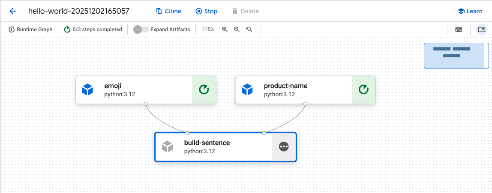
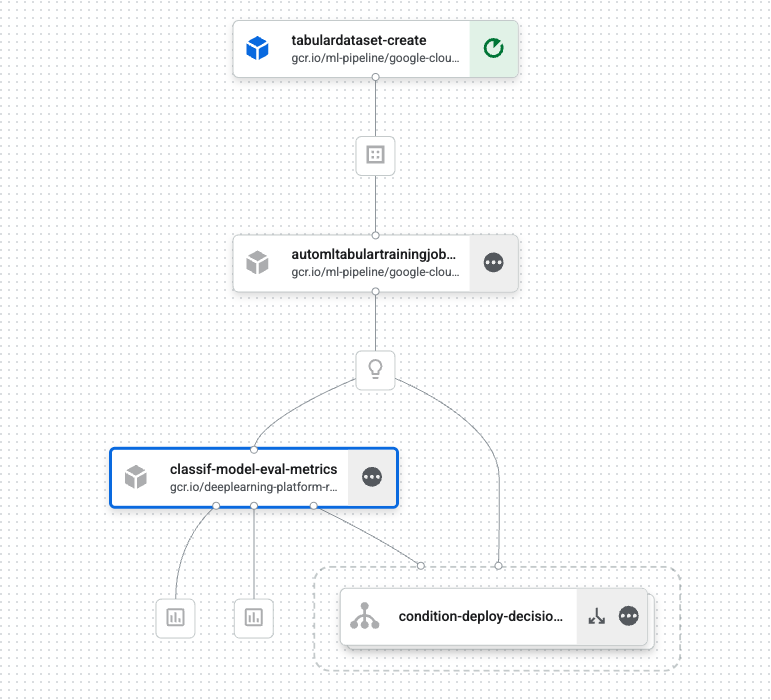

# 🔄 Vertex AI Pipelines - Qwik Start

## 1. Resumen del Lab

Este lab vimos com automatizar y reproducir workflows de ML usando Vertex AI Pipelines

- **Automatización de workflows ML**: Convertir procesos manuales en pipelines reproducibles y ejecutables
- **Gestión de dependencias**: Cada paso del pipeline es un contenedor independiente con sus propias dependencias
- **Reproducibilidad**: Trackear inputs y outputs de cada paso para garantizar resultados consistentes
- **Integración con servicios de Vertex AI**: Usar componentes pre-construidos para interactuar con AutoML, datasets, modelos y endpoints

## 2. Tareas principales realizadas

Configuración inicial del entorno:
El primer paso consistió en instalar las librerías necesarias: el Kubeflow Pipelines SDK y Google Cloud Pipeline Components. Luego configuré el proyecto ID y el bucket de Cloud Storage, definiendo las rutas donde se almacenarían los artefactos generados por el pipeline.

Creación de un pipeline sencilo de 3 componentes:
Construí un pipeline simple de tres componentes. Comencé creando componentes personalizados usando decoradores `@component`, donde cada componente toma inputs y produce outputs específicos. Luego conecté estos componentes en un pipeline usando el decorador `@dsl.pipeline`. Una vez definido el pipeline, lo compilé a formato JSON, lo ejecuté en Vertex AI Pipelines y monitoreé su progreso, visualizando los resultados finales en la consola de Google Cloud.

Construcción de un pipeline ML end-to-end**

El siguiente paso fue construir un pipeline completo de machine learning. Creé un componente personalizado para evaluación de modelos que calcula métricas de clasificación y decide si el modelo cumple con los umbrales establecidos. Complementé esto con componentes pre-construidos de Google Cloud Pipeline Components: `TabularDatasetCreateOp` para crear datasets tabulares desde BigQuery, `AutoMLTabularTrainingJobRunOp` para entrenar modelos AutoML de clasificación, y `ModelDeployOp` para desplegar modelos a endpoints de Vertex AI. Implementé lógica condicional usando `dsl.Condition` para que el deployment solo ocurra si las métricas superan ciertos umbrales. Durante la ejecución, visualicé métricas como curvas ROC y matrices de confusión en la interfaz de Vertex AI Pipelines, y utilicé lineage tracking para rastrear todos los artefactos creados durante el proceso.

### 3. Conceptos/técnicas incorporadas

Componentes como contenedores independientes:
Comprendí que cada componente funciona como un contenedor independiente con su propia imagen base y dependencias específicas. Los componentes se comunican mediante inputs y outputs. Esta arquitectura permite desarrollar componentes de forma independiente y reutilizarlos en diferentes pipelines.

Pipeline como grafo de ejecución:
Aprendí que los pipelines se definen como grafos de ejecución donde se especifican las dependencias entre componentes. Los outputs de un componente alimentan directamente los inputs de otros, creando un flujo de datos estructurado. El sistema maneja automáticamente la ejecución paralela cuando es posible, optimizando el tiempo total de ejecución del pipeline.

### 4. Conclusiones

Lo más valioso de este lab fue comprender cómo automatizar completamente el ciclo de ML, desde la creación del dataset hasta el deployment del modelo.
Cada paso del pipeline es independiente, lo que facilita el debugging al permitir identificar exactamente dónde falla el proceso, simplifica la optimización al poder mejorar un paso sin afectar otros componentes, y promueve la reutilización de componentes en diferentes pipelines.
