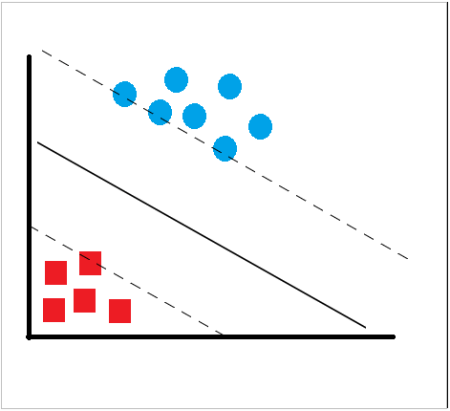
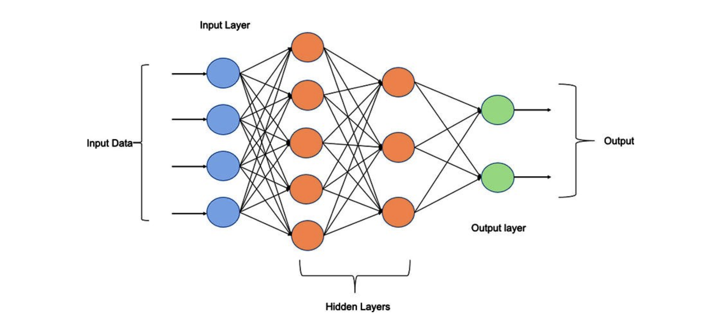
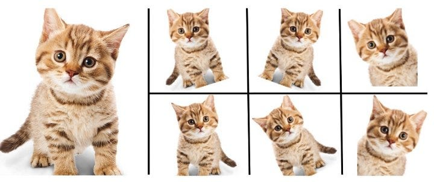
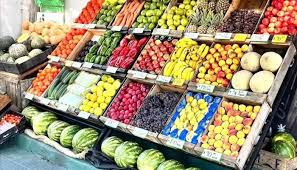

# 🤖 Portfolio

## 📊 Unidad Temática 1 - Machine Learning Clásico

Fundamentos de Machine Learning: análisis exploratorio de datos, regresión lineal y logística, validación cruzada, y clustering con PCA. Desde predicción de supervivencia en Titanic hasta segmentación de clientes.

### [Descifrando los secretos del Titanic a través de los datos](01-eda-titanic.md)

### [De datos crudos a modelos predictivos: construyendo nuestro primer clasificador](02-baseline-logreg.md)

### [Cuando las líneas rectas no bastan: explorando regresión lineal y logística](03-regresion-lineal-logistica.md)

### [Evitando el sobreajuste: técnicas de validación para modelos robustos y evitar que los estudiantes dejen de asistir a clases](04-validacion-seleccion-modelos.md)

### [Mall Customer Analytics: usando PCA y clustering para entender comportamiento de compra](05-clustering-pca-mall-customers.md)

## 🧠 Unidad Temática 2 - Redes Neuronales y Deep Learning

Del perceptrón a redes multicapa (MLP): arquitecturas, backpropagation, optimizadores (SGD, Adam, RMSprop) y técnicas de regularización. Experimentación práctica con TensorBoard y callbacks.

### [Del perceptrón a las redes multicapa: resolviendo problemas no linealmente separables](06-redes-neuronales-perceptron.md)

### [Experimentacion con redes neuronales: arquitecturas, optimizadores y callbacks](08-backpropagation-optimizadores.md)

## 👁️ Unidad Temática 3 - Visión por Computadora

CNNs desde cero y transfer learning, data augmentation avanzado (Mixup, CutMix), explicabilidad con GradCAM, fine-tuning de YOLOv8 para detección y tracking, y segmentación con SAM para disaster response.

### [CNNs desde cero y aprovechando modelos preentrenados](09-cnn-transfer-learning.md)

### [Técnicas avanzadas de augmentation (Mixup, CutMix) y visualización de decisiones con GradCAM](10-data-augmentation-xai.md)

### [Fine-tuning de YOLOv8 para detección específica de productos de supermercado y tracking en video](11-yolo-finetuning-tracking.md)

### [Segmentación de inundaciones con SAM: comparando zero-shot vs fine-tuned para disaster response](12-sam-flood-segmentation.md)

## 🗣️ Unidad Temática 4 - Procesamiento de Lenguaje Natural (NLP)

Fine-tuning de BERT (FinBERT) para análisis de sentimiento financiero, y LangChain para aplicaciones LLM: prompting, salidas estructuradas con Pydantic, y RAG (Retrieval-Augmented Generation).

### [Análisis de sentimiento financiero: comparando TF-IDF vs Fine-tuning de BERT](13-bert-financial-sentiment-analysis.md)

### [LLMs con LangChain: Prompting, Plantillas y Salida Estructurada con OpenAI](14-langchain-llm-prompting.md)

